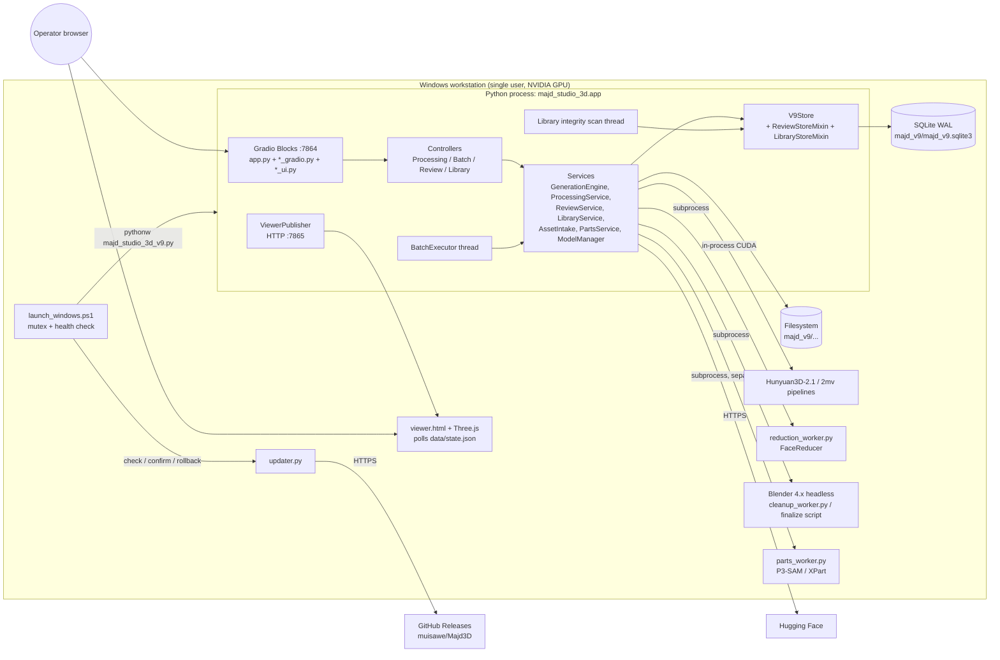
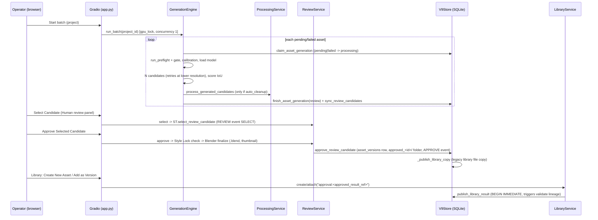
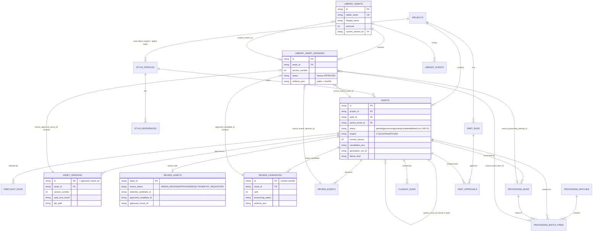
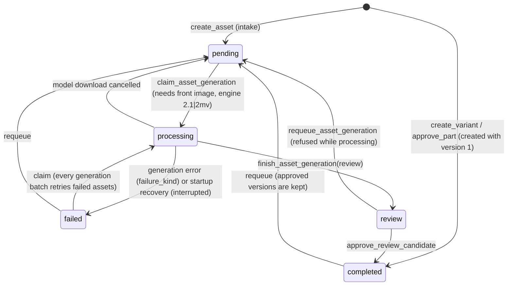

# Asset Management Knowledge Transfer: Majd Studio 3D

> **Purpose.** This report hands this codebase over to another AI assistant (ChatGPT) that has never seen it. That assistant should be able to discuss architecture, find problems and plan development without re-reading the repository.
>
> **Repository snapshot**
>
> | Item | Value |
> |---|---|
> | Local folder | `Majd_Studio_3D/` |
> | Source repository | `github.com/muisawe/Majd-Studio-3D` (git `origin`) |
> | Update/release repository | `muisawe/Majd3D` (`update_config.json`, `scripts/publish_release.py`) |
> | Branch / HEAD | `main` @ `b9c5e14` "Version 9.0.0-beta.6", tagged `v9.0.0-beta.6`, in sync with `origin/main`, clean working tree |
> | App version | `9.0.0-beta.6` (`version.json`) |
> | Database schema version | `99` (`majd_studio_3d/store.py`, `SCHEMA_VERSION`) |
> | Analysis date | 2026-10-10 |
>
> Two commits landed from outside this analysis while it was running: `feeff14` (reliability work, already read here as uncommitted changes) and `b9c5e14` (version bump plus `MANIFEST.json`). The analysis matches the code at `b9c5e14`.

## How to read this report

Every important claim carries one of these labels:

- **FACT**: verified in this repository's source, config, tests or git history. A citation is given as `path` plus a function name or line.
- **INFERENCE**: a reasoned conclusion from facts, such as runtime behaviour on the Windows/GPU machine or performance at scale. It is plausible but not proven here.
- **UNKNOWN**: the repository cannot answer it.

**Scope inspected:**
- All 41 Python modules in `majd_studio_3d/` (about 9,850 lines).
- `scripts/` (2 Python files, 2 PowerShell files).
- `viewer/` (HTML, CSS, JS).
- All 43 test modules plus the PowerShell launcher test.
- Both GitHub Actions workflows.
- `README.md`, `roadmap.md`, `docs/asset-library.md`, `MANIFEST.json`, `version.json`, `update_config.json`.
- The full git history (13 commits).

**Excluded:**
- `dist/`: stale beta.5 build artefacts.
- `__pycache__/` and `.ruff_cache/`.
- `.omx/`: git-ignored tool state.
- `previews/`: a static UI mock-up, skimmed only.

**Secrets:** none found in tracked files. Only secret *names* appear: the GitHub Actions secret `MAJD3D_RELEASE_TOKEN` and the optional environment variable `HF_TOKEN`.

---

## 0. Critical framing: "Asset Management" here means 3D asset production

**FACT.** No project in this workspace is called "Asset Management". The repository is **Majd Studio 3D**, and it describes itself in two ways:
- `majd_studio_3d/app.py` docstring: *"Multi-Project / Multi-Style Asset Factory"*.
- `roadmap.md` §1: a *"multi-project, multi-art-direction 3D asset production system, not just a UI for an Image-to-3D model"*.

Here an **asset is a 3D model**: a character, prop, environment element, building, organic sculpt or vehicle. The system:
1. Generates the model with AI image-to-3D models (Tencent **Hunyuan3D**).
2. Scores and cleans it.
3. Has a human approve it.
4. Stores it as an immutable version in an **Asset Library** with full lineage.

**FACT.** This is **not** an IT, fixed-asset or equipment management system. None of these exist in the code:
- people or custodians
- check-in/check-out
- locations
- maintenance schedules or work orders
- depreciation or financial values
- physical stock counts
- disposal approvals

§4.18 maps each requested lifecycle stage (registration, assignment, custody, transfer, maintenance, inventory, disposal, auditing) to its nearest real analogue and says plainly where none exists.

---

## 1. Project Overview

### 1.1 What the system does

**FACT.** It is a **local, single-workstation web application**:
- A Gradio UI on `http://127.0.0.1:7864` (`app.py`, last line: `app.launch(server_name="127.0.0.1", server_port=7864, share=False)`).
- A standalone Three.js viewer on `http://127.0.0.1:7865/viewer.html` (`viewer_publisher.py`, `ViewerPublisher.start_server`).
- It is installed on a **Windows machine with an NVIDIA GPU**, into an existing Hunyuan3D-2.1 installation (default `E:\AI\Hunyuan3D-2.1`, see `scripts/install_windows.ps1`).

End-to-end, it can:
1. Organise work into **Projects** and **Style Profiles**, the art-direction rules: generation defaults, a face budget and QA thresholds.
2. **Register assets** from reference images (front, back, left, right, 3/4 and detail) one at a time, or by bulk folder import.
3. Run **Preflight** image checks and **Calibration** that normalises the views to a common canvas.
4. **Generate** several candidate meshes per asset with Hunyuan3D-2.1 (single view) or Hunyuan3D-2mv (multi-view).
5. **Score** each candidate by silhouette IoU against the references, plus an experimental "geometry-style" score.
6. Optionally **post-process** candidates: Hunyuan's native FaceReducer, then headless **Blender 4.x** geometry cleanup, then validation.
7. Hold a **human review** where the reviewer explicitly selects one candidate, then approves, rejects or requests a retry. Approval creates an immutable approved version.
8. **Publish** approved results to a durable **Asset Library** with stable identities, monotonic immutable versions, lineage, SHA-256 integrity evidence, and archive/restore.
9. **Split meshes into parts** with P3-SAM, optionally reconstructed with XPart, and approve parts as new assets.
10. **Download and verify** model weights from Hugging Face, with resume support.
11. **Self-update** from GitHub Releases, with SHA-256 verification and automatic rollback when startup fails.

### 1.2 Business problems it addresses

Source: `roadmap.md` §2. **FACT** that they are stated goals; how far each is implemented varies (see §6).
- Keep character identity and art style consistent across a whole project and across many assets.
- Manage several projects, and several styles per project.
- Version assets non-destructively. An approved result is never overwritten.
- Compare several AI candidates instead of accepting the first output.
- Check silhouettes and proportions, and normalise front/back/side inputs.
- Record provenance: source images, engine, seed, settings and QA evidence.
- Reuse assets across projects without damaging the original.
- Track texture, topology and rig readiness later. **Not implemented.**

### 1.3 Intended users and stakeholders

- **FACT:** there are no user accounts or roles. README §"Human review and approval": *"There is no authenticated reviewer identity in the current local app."* Approval provenance is the literal string `"approved_by": "human"` (`store.py`, `approve_part`).
- **INFERENCE** from `roadmap.md`: the stakeholder is **Majd Studio**, a content studio making animated stories, films, videos and games. The roadmap mentions the project "Sami Stories", the characters "Sami" and "Bibi", and a content guideline aligned with the studio's Islamic values (§4).
- **INFERENCE** about implied roles:
  - 3D operator/artist: registers assets and runs batches.
  - Art director: makes the human approval decisions.
  - Maintainer: owns releases. Git history shows a single maintainer.
- **FACT:** the UI is primarily **Arabic, right-to-left** (`CSS` in `app.py` sets `direction:rtl`). The newer panels (processing, batch, review, library) are in English.

### 1.4 Main business workflows

1. **Set up:** create a project, create or choose a style profile, attach approved style references.
2. **Intake:** create an asset with view images, or import a folder named `name__front.png`, `name__back.png` and so on.
3. **Generation batch:** "Start batch" processes every `pending` or `failed` asset in the project. Each asset passes the preflight gate, then calibration, then candidate generation and scoring, then optional auto-processing, and lands in status `review`.
4. **Processing:** run on one candidate, or as a persisted serial batch. It goes FaceReducer, then Blender cleanup, then validation, on a pinned raw input with a frozen configuration.
5. **Human review:** select a candidate, then approve it (Style Lock check, plus Blender finalisation into `.blend` and a thumbnail when enabled), or reject it, or request a retry.
6. **Library publication:** take an "Unassigned Approved Result" and either create a new library asset (v001) or add it as a new version of an existing one. Then set the current version, edit metadata, archive or restore.
7. **Legacy library:** promote an asset to global scope, or create a variant in another project/style.
8. **Parts:** segment an approved or uploaded mesh, then approve a part as a new asset.
9. **Models:** download and verify weights.
10. **Update:** the launcher checks GitHub, applies the update, runs a health check, then confirms or rolls back.

### 1.5 Current development stage

- **FACT:**
  - Version `9.0.0-beta.6`.
  - The docs call it **"V9 Phase 2.1 Beta"**.
  - The README documents recently added sub-phases **C to G**: processing service, processing UI, batch processing and cleanup, human review, Asset Library.
  - The latest commit `feeff14` adds roadmap "Phase 8 Reliability" items: logging, atomic writes, crash recovery, generation resume, DB backups and an integrity scan.
- **FACT:** git history covers only 2026-10-09 to 2026-10-10 (13 commits). The first commit, *"Initial commit: Majd Studio 3D V9 beta.5"*, imported an existing codebase wholesale.
- **UNKNOWN:** the history of V8 and of earlier V9 phases is not in git.
- **FACT:** the docs say plainly that **real GPU inference, Blender execution and the full Windows install/update cycle have not been verified** in the development environment (`README.md` §"Verification limits", and `roadmap.md` §9: *"No feature is Production-Ready before it is actually tested on the production machine"*).

### 1.6 Scope, objectives and explicit non-goals

- **Long-term objective** (`roadmap.md` §5, §23–25): an engine-agnostic production layer. The intended chain is Project, then Style, then References, then validated inputs, then generation, then automated QA, then human art direction, then texture/topology/rig, then a production asset, then export to Majd Studio, Blender, Unity, Unreal or Web.
- **Explicit non-goals for now** (`roadmap.md` §21):
  - no animation engine
  - no game engine
  - no texture work before the shape pipeline is stable
  - no AI score replacing the human reviewer
  - no fully automatic retopology before topology standards exist
  - no project-specific changes to the core architecture
  - no Blender- or Rigify-specific identifiers in the core

---

## 2. Technology Stack

| Layer | Technology | Version (verifiability) | Evidence |
|---|---|---|---|
| Language | Python | **3.10** in CI, comment "Match the Hunyuan3D-2.1 venv" (FACT) | `.github/workflows/ci.yml` |
| UI framework | **Gradio Blocks** (server-rendered Python UI, RTL CSS) | **5.33.0** pinned (FACT) | `scripts/install_windows.ps1:59`, `ci.yml` |
| 3D viewer | **Three.js** ES modules with OrbitControls and GLTFLoader; vanilla JS polls `data/state.json` every 900 ms | **0.180.0**, downloaded from jsDelivr at install (FACT) | `install_windows.ps1:77`, `viewer/viewer.js` |
| Viewer server | stdlib `ThreadingHTTPServer` on `127.0.0.1:7865` | (FACT) | `viewer_publisher.py:52` |
| Backend architecture | One in-process Python monolith: Gradio callbacks, then controllers, services and the store. No REST framework | (FACT) | `app.py` |
| Database | **SQLite** via stdlib `sqlite3`; WAL journal; `PRAGMA foreign_keys=ON`; no ORM; raw SQL | schema 99 (FACT) | `store.py:66-71` |
| ML runtime | PyTorch with CUDA, reused from the Hunyuan venv | **UNKNOWN**: not pinned here. The parts runtime requires CUDA 12.x (`parts.py:126`) | `generation.py` |
| Shape generation | Hunyuan3D-2.1 (`hy3dshape`), Hunyuan3D-2mv (`hy3dgen`) | Weights from HF `tencent/Hunyuan3D-2.1` and `tencent/Hunyuan3D-2mv` at revision `main`; offline fallback manifests pinned to commits (FACT) | `model_manager.py` `MODEL_SPECS`, `verified_model_metadata.py` |
| Part segmentation | P3-SAM, XPart (`tencent/Hunyuan3D-Part`), Sonata backbone (`facebook/sonata`) | Code pinned to space revision `27cacbd…`, run in a separate venv (FACT) | `model_manager.py:22`, `parts.py` |
| Image/mesh libraries | numpy, Pillow, trimesh, scipy (CI), rembg, onnxruntime, pymeshlab, pygltflib, xatlas, omegaconf, accelerate | **Unpinned** (`pip install --upgrade`) (FACT) | `install_windows.ps1:57-60` |
| DCC tool | **Blender 4.x**, headless (`bpy`) | The cleanup worker rejects any major version other than 4 (FACT) | `cleanup_worker.py:265`, `cleanup.py:104` |
| Authentication/authorisation | **None.** Mitigated only by binding to localhost | (FACT) | `app.py`, `viewer_publisher.py` |
| External integrations | Hugging Face (weights and API metadata), GitHub REST API and Releases (updates), `data.pyg.org` (PyG wheels for the parts venv), jsDelivr (Three.js), `git clone` of `Tencent-Hunyuan/Hunyuan3D-2`, `winget` (Git install) | (FACT) | `model_manager.py`, `updater.py`, `parts.py`, `install_windows.ps1` |
| Background work | Python threads: the processing-batch executor and the startup integrity scan. Subprocess workers: Blender, FaceReducer, the parts venv. The Gradio queue (`concurrency_id="gpu_operation"`, limit 1). **No external queue or broker** | (FACT) | `batch_processing.py`, `library_controller.py`, `parts.py:run_process` |
| Notifications | **None.** The UI polls through `gr.Timer(2)` in the processing and batch panels | (FACT) | `processing_gradio.py:27`, `batch_gradio.py:35` |
| Storage | Local filesystem under `<install>/majd_v9/` (layout in §5.7) | (FACT) | `app.py:72-81` |
| Logging | stdlib `logging`: `v9.log` rotating 10 MB × 5, plus `faults.log` (faulthandler), batch JSONL logs, processing JSON logs, `launcher.log` | (FACT) | `logging_setup.py`, `batch_processing.py:log` |
| Testing | stdlib `unittest` with `unittest.mock`; real-Blender suites skip themselves when Blender is absent | About 350 test methods in 43 modules (FACT) | `tests/` |
| CI/CD | GitHub Actions on `windows-latest`: compile, unit tests, PowerShell parse, launcher health test, package build. The release workflow publishes through the `gh` CLI | `actions/*@v7` (FACT) | `.github/workflows/ci.yml`, `release.yml` |
| Packaging/deploy | `install.cmd` calls the PowerShell installer, which creates a desktop shortcut to the launcher. Two ZIPs: a **bootstrap** (full) and an **update** (app code and viewer only) | (FACT) | `scripts/build_release.py`, `scripts/*.ps1` |

---

## 3. System Architecture

### 3.1 Directory structure and responsibilities

| Path | Responsibility |
|---|---|
| `majd_studio_3d_v9.py` | Compatibility entry point. Importing `majd_studio_3d.app` **starts the whole application** |
| `majd_studio_3d/app.py` (1,236 lines) | **Composition root, legacy UI and its handlers.** Paths, DB backup, instance lock, store, recovery, controllers, viewer server, GPU and Blender detection, presets, every legacy tab, `gr.Blocks` layout, event bindings, `app.launch()`. All of it runs **at import time** |
| `store.py` (1,733 lines) | `V9Store`, the data layer. Schema creation and migration; projects, styles, assets, legacy versions, style references, preflight, Style Lock, variants, cleanup and processing runs, processing batches and items, parts. Mixes in review and library behaviour |
| `review_store.py` | `ReviewStoreMixin`: review schema, candidate freezing, selection, approval, rejection, retry (Phase F) |
| `library_store.py` | `LibraryStoreMixin`: library schema and triggers, publication, current version, metadata, archive, counters, integrity scan (Phase G) |
| `asset_intake.py` | `AssetIntake`: create an asset and import a folder; engine auto-selection |
| `input_qa.py` | Preflight analysis, silhouette-based calibration, the experimental geometry-style score (numpy/Pillow) |
| `generation.py` | `GenerationEngine`: model loading, candidate generation, retries, resume markers, failure classification, generation batch loop |
| `candidate_qa.py` | Silhouette IoU scoring of a mesh against reference masks |
| `processing.py` | `ProcessingService`: canonical raw resolution, reuse cache, FaceReducer then Blender cleanup then validation pipeline, provenance recording. CLI included |
| `reduction_worker.py` | Subprocess: Hunyuan FaceReducer adapter and mesh inspection |
| `cleanup.py`, `cleanup_worker.py`, `cleanup_config.py` | Blender cleanup service, the Blender-side worker script, and the validated `cleanup_config.json` |
| `processing_controller.py` | Orchestrates single-candidate processing for the UI; batch entry point `run_frozen` |
| `batch_processing.py`, `batch_controller.py` | `BatchExecutor` (serial, leased, cancellable) and the batch read model and commands |
| `review_service.py`, `review_controller.py` | Human-review commands (select, approve, reject, retry, bulk approve) and read models |
| `library_service.py`, `library_controller.py` | Library commands and read models; background integrity scan |
| `*_gradio.py` | Thin Gradio bindings for the processing, batch, review and library panels |
| `*_ui.py` | Pure, **HTML-escaped** renderers for those panels |
| `blender_finalize.py` | Windows-only Blender discovery; generated Blender script that scales, grounds, smooths, renders a thumbnail and saves a `.blend` |
| `viewer_publisher.py` | Copies models and references into the viewer `data/` folder, writes `state.json` atomically, serves the viewer |
| `parts.py`, `parts_worker.py` | Prepares the separate parts venv; runs P3-SAM/XPart jobs in a subprocess |
| `model_manager.py`, `verified_model_metadata.py` | Verified, resumable Hugging Face downloads; offline checksum manifests |
| `updater.py` | Check, download, verify, apply, confirm and roll back GitHub releases (runs from the launcher, before the app starts) |
| `atomic_io.py`, `db_backup.py`, `instance_lock.py`, `logging_setup.py` | Reliability utilities added in commit `feeff14` |
| `constants.py` | `VIEW_KEYS` and the Arabic status labels `STATUS_AR` |
| `viewer/` | `viewer.html`, `viewer.css`, `viewer.js` (Three.js app). The installer copies it to `<install>/majd_viewer_v9/` |
| `scripts/` | `install_windows.ps1`, `launch_windows.ps1`, `build_release.py`, `publish_release.py` |
| `tests/` | Unit and integration tests; `tests/windows/test_launcher.ps1` |
| `docs/asset-library.md` | Phase G architecture note: the only design document besides the README and roadmap |
| `previews/mac_ui.html/.css` | Static UI mock-up, not connected to anything (README) |

### 3.2 Runtime topology



### 3.3 Architectural patterns (FACT unless marked)

- **Layering in the newer code:** `*_gradio.py` (bindings), then `*_ui.py` (pure renderers), then `*_controller.py` (read models and UI orchestration), then `*_service.py` (commands), then the `V9Store` mixins (persistence). Services and stores import **no Gradio**, so they can be tested without a UI.
- **Legacy code is not layered.** `app.py` holds many handlers that call `STORE` directly: projects, styles, intake, the legacy review/approve button, the legacy library, variants, parts, models.
- **Composition at import time.** `app.py` runs everything when the module is imported, in this order:
  1. backup
  2. instance lock
  3. migrations
  4. recovery
  5. controllers
  6. review sync
  7. viewer server
  8. UI build
  9. `launch()`
  
  There is no `main()`. Tests rebuild parts of the UI by parsing `app.py` with `ast` (`tests/test_processing_app_ui.py`).
- **Mixins** combine the persistence concerns: `class V9Store(ReviewStoreMixin, LibraryStoreMixin)`.
- **Immutability and provenance first:**
  - frozen configuration snapshots
  - pinned raw inputs
  - per-artifact SHA-256
  - append-only events
  - idempotent re-recording of runs, where changing a run requires a new ID
- **Leases and claims for concurrency:**
  - generation claims: `claim_asset_generation`, with an owner token and PID
  - batch leases: `claim_processing_batch`, `claim_next_processing_item`
  - all taken inside `BEGIN IMMEDIATE` transactions
- **Crash recovery:**
  - Stale generation claims are marked `failed/interrupted` at startup.
  - Abandoned batch leases are recovered, and in-flight items become retryable failures.
  - Expensive work **never resumes automatically**.
- **File markers as secondary provenance:**
  - `generation.json` per candidate, used for resume
  - `processing.json` and `raw_source.json`, which stop a mesh from being reduced twice
  - `manifest.json` per version
- **Subprocess isolation** for heavy or third-party runtimes, using a JSON request/result protocol and `MAJD_*_PROGRESS` stdout lines (`parts.run_process`).
- **Atomic file writes** (`atomic_io.py`): temp file, then fsync, then `os.replace` with retries on Windows.

### 3.4 Request flow: generation through to library publication



### 3.5 How the parts communicate

- **Browser to app:** the Gradio websocket/HTTP API. Many handlers in the newer panels use `queue=False, api_name=False`. GPU-heavy actions share `concurrency_id="gpu_operation"` with `concurrency_limit=1`.
- **App to viewer:** the filesystem. `ViewerPublisher.publish` copies GLBs and the reference image into `majd_viewer_v9/data/` and atomically rewrites `state.json`. The viewer **polls** `state.json` every 900 ms and is embedded as an `<iframe>`.
- **App to subprocesses:** JSON request files, plus progress parsed from stdout, plus a JSON result file. Cancellation is cooperative through `threading.Event` or `ItemCancellation`, which polls the DB every 0.15 s. Timeouts are enforced in `run_process`.
- **App to DB:** a new SQLite connection per operation (`V9Store.connect`, using `_ClosingConnection`, which closes on context exit so Windows releases the file). Write transactions use `BEGIN IMMEDIATE`.
- **Launcher to updater to app:** `launch_windows.ps1` runs `python updater.py check|confirm|rollback` and then starts `pythonw majd_studio_3d_v9.py`. It calls the start healthy when port 7864 is listening inside the process tree and answers HTTP 200 within **300 s** (`Wait-For-Studio`).

### 3.6 Important design decisions and constraints

| # | Decision or constraint | Evidence |
|---|---|---|
| D1 | **The human approval is final.** Automated scores are QA evidence only, and ranking never selects or approves (rank 1 is never a default) | `roadmap.md` §3.3; `review_store.approve_review_candidate` requires `selected_candidate_id` |
| D2 | **Non-destructive by design.** Originals, raw meshes and approved versions are never overwritten; there is no destructive delete in the library | `roadmap.md` §3.4; `docs/asset-library.md`; no delete API |
| D3 | **Processing identity is kept separate from library identity.** `assets` rows are generation/review work items; `library_assets` rows are durable production identities. A matching name never implies the same identity | `docs/asset-library.md` §"Identity boundaries" |
| D4 | **Library versions reference the files frozen in Phase F**, with SHA-256 snapshots, instead of copying them again | `library_store.publish_library_result` |
| D5 | **Serial processing batches** (concurrency 1), started explicitly; never resumed automatically after a crash | `batch_processing.BatchExecutor.concurrency = 1`; README |
| D6 | **Configuration is frozen per batch and per run.** Later edits to settings or `BLENDER_PATH` do not change history | `store.create_processing_batch`; `processing._snapshot` |
| D7 | **One absolute face budget** is shared by FaceReducer and Blender, so a mesh is never reduced twice | `cleanup.shared_face_budget` |
| D8 | **Heavy and third-party runtimes run in subprocesses.** Parts use a separate venv | `parts.py`, `processing._reduce`, `cleanup.CleanupService` |
| D9 | **Updates replace application code only.** DB migrations must stay backward compatible; rollback never replaces the live DB | README §"Updates"; `updater.rollback` |
| D10 | **Target architecture is an engine-agnostic "Majd Core" with adapters.** Partially honoured (INFERENCE): review, library and batch are engine-agnostic, but generation is Hunyuan-specific, and `"2.1"`/`"2mv"` are hard-coded in `store.claim_asset_generation` and `processing.process` | `roadmap.md` §24 |
| D11 | **Windows-first deployment** into the Hunyuan3D-2.1 folder. The app's `ROOT` is that folder, so data lives in `E:\AI\Hunyuan3D-2.1\majd_v9\` by default | `install_windows.ps1`, `app.py:33` |

---

## 4. Business Logic and Features by Module

Each module lists its purpose, rules, operations, entities, roles, dependencies and status. Roles are the same everywhere: **no roles or permissions exist** (FACT). Anyone who can reach `127.0.0.1:7864` can do everything.

### 4.1 Projects
- **Purpose:** the top-level workspace.
- **Rules (FACT, `store.create_project`):**
  - The name is required.
  - The slug is unique, and gets `_2`, `_3` and so on when needed.
  - A default style "Default Style" is created.
  - On first start, the DB is seeded with "Majd Default Project" and the style "Majd Soft 3D" (`ensure_defaults`).
- **Operations:** create, list, set default style.
- `archive_project` exists in the store but **has no UI and no caller** (FACT, grep).
- **Entities:** `projects`.
- **Status:** implemented. Verified only indirectly by tests: `test_store` covers the default project.

### 4.2 Style Profiles and Style References
- **Purpose:** art-direction rules and generation defaults.
- **Scope:** a style belongs to a project (`project_id`) or is global (`project_id IS NULL`).
- **Fields (FACT, schema):**
  - descriptive text: shape language, proportions, palette, materials, topology notes
  - `poly_budget` (default 50,000)
  - `min_silhouette_score`, `engine_mode`, `candidates`, `steps`, `guidance`, `resolution`
  - `locked` (Style Lock on/off)
  - Phase 2 additions: `preflight_required`, `min_preflight_score` (0.75), `calibration_enabled`, `calibration_canvas` (1024), `target_occupancy` (0.82), `min_style_geometry_score`
- **References:** image files copied into the project's or the library's `style_references/<style_id>/`, with a category (role), view, label and weight (`store.add_style_reference`). Deleting a reference is a **hard delete** of the row and the file (`delete_style_reference`).
- **Rules:**
  - `update_style` uses an allow-list of columns.
  - The UI refuses to set another project's style as the default (`app.set_default_style_action`).
- **Status:** implemented; **no direct tests** (FACT).

### 4.3 Style Lock and conformance
**Style Lock**, `store.style_lock_check(asset_id, candidate)` (FACT):
- Returns `OFF` when the asset's `style_lock` is off, or its style is missing or unlocked.
- Returns **FAIL** when any of these hold:
  - preflight is required but was not run, has status FAIL, or scored below `min_preflight_score`
  - `faces > poly_budget`
  - silhouette `score < min_silhouette_score`
  - geometry-style score `< min_style_geometry_score`, when the minimum is above 0 and a score exists
- Returns **WARN** when either holds:
  - a geometry minimum is set but no score is available
  - the asset's resolution, steps or guidance differ from the style's
- Returns **PASS** otherwise.

**Approval behaviour:**
- A FAIL blocks approval unless `override_style_lock=True`. The version is then stored with `style_lock_result='OVERRIDE'`, and the review event metadata records `override_style_lock`.
- **The override is reachable only from the legacy Review tab checkbox.** The Phase F "Approve Selected Candidate" button and Bulk Approve never pass an override (FACT: `review_gradio.py`, where `controller.approve(asset_id)` has no flag).
- **No override reason is captured**, although `roadmap.md` §8 requires one (FACT).

**Conformance**, `store.style_conformance_check`: a weighted, display-only score.
- Without a geometry score: 0.45 silhouette, 0.25 preflight, 0.15 poly budget, 0.15 settings.
- With a geometry score: 0.35 / 0.20 / 0.15 / 0.10 / 0.20.
- It is shown in the candidate details (`review_controller.candidate_summary`) and **never gates anything**.

**Status:** implemented; **no direct tests** (FACT).

### 4.4 Asset intake (registration of work items)
`asset_intake.AssetIntake` (FACT):
- **Required inputs:** project, style, name and a **front** image.
- Images are copied into `<asset>/input/<view>.<ext>`.
- **Engine selection:**
  - explicit `Single View 2.1` or `Multi-View 2mv` (2mv raises an error if its runtime is not ready)
  - `Auto` chooses `2mv` when at least 2 cardinal views exist and 2mv is ready, and `2.1` otherwise
- **Folder import:**
  - globs `*.png`, `*.jpg`, `*.jpeg`, `*.webp`
  - groups files by the `name__<view>` suffix (`front|f|back|rear|left|l|right|r|3q|threeq|threequarter|detail|closeup`)
  - unsuffixed files count as front
  - a group with no front is skipped
  - with `skip_existing`, names already in the project are skipped
- **Presets** (`app.PRESETS`, keyed by Arabic type names): character, environment element, prop, building, organic, vehicle. They set candidates, steps, guidance, resolution, target size and library category.
- **Quality presets:** Draft, Balanced, High Quality, Custom.
- **Entity:** an `assets` row created in status `pending`.
- **Status:** implemented and tested (`test_asset_intake`, 5 tests).

### 4.5 Preflight and calibration
`input_qa.py`: deterministic, with no ML (FACT).
- **Subject mask:** taken from the alpha channel, or else estimated from the corner colours of the background.
- **Per-image checks:** resolution, separation, cropping, size, centring.
- **Multi-view scale consistency:** a view whose subject height differs from the median by more than 22% is a FAIL; by more than 12% it is a WARN.
- **Calibration:** crops each view and rescales it onto a square canvas (`calibration_canvas`) at `target_occupancy` height, on a fixed baseline. The original images are kept.
- **Gate** (in `generation._generate`): when the style has `preflight_required` and the result is a FAIL or scores below the minimum, `PreflightGateError` sets the asset to `failed` with `failure_kind='preflight_gate'`.
- **Experimental geometry-style score:** `exp(-2.35·distance)` over the aspect, fill and symmetry of reference silhouettes, weighted by reference weight. It explicitly does **not** detect landmarks (module docstring).
- **Status:** implemented. **No unit tests for `input_qa`** (FACT). The installer runs one smoke check.

### 4.6 Generation
`generation.GenerationEngine` (FACT):
- `run_batch(project_id)`:
  - takes every asset of the project in status **`pending` or `failed`**, optionally grouped by engine
  - refuses to start, and stops mid-run, when free disk drops below **2 GB**
  - "Stop" takes effect after the current asset
  - each asset runs under `gpu_lock`
- `process_asset` claim rules:
  - the asset needs a front image
  - its engine must be `2.1` or `2mv`
  - its status must be `pending` or `failed`
  - the claim sets status `processing`, plus an owner token, the PID and a `generation_run_id`
- **Candidates:**
  - there are `candidates` of them (1 to 5)
  - each gets `retry_count + 1` attempts
  - the first attempt uses the configured resolution; the second caps it at 256; the third and later use 128 (an OOM strategy)
- **Seeds:** Sequential is `base + index + attempt*1000`; Fixed is `base`; Random is `os.urandom`.
- **Scoring:** `candidate_qa.score_candidate`. It averages a flip-invariant silhouette IoU over the available views: front 0°, back 180°, left 90°, right -90°, 3/4 ±45°. Candidates are sorted by score, and the best becomes `best_glb`.
- **Resume:** each saved candidate writes `generation.json`, holding the run ID, a settings digest and the GLB's SHA-256 and size. After an interruption, matching candidates are reused (`reusable_candidate`, `generation_digest`).
- **Failure kinds:** `preflight_gate`, `runtime_unavailable`, `oom`, `disk_full`, `download_cancelled`, `interrupted`, `unknown`.
- **Metrics:** per-candidate seconds, model load time and peak VRAM go into `assets.generation_metrics_json`.
- The model weights are downloaded automatically if missing (`model_manager.ensure`).
- **Status:**
  - The claim, resume and store logic is tested (`test_generation_store` 5, `test_generation_resume` 5, the latter skipped without numpy).
  - Real Hunyuan inference is **not verified** (README).

### 4.7 Post-generation processing (FaceReducer, then Blender cleanup)
`processing.ProcessingService.process` (FACT):
1. **Canonical raw.** Resolve the true raw mesh, refusing to treat a processed output as new raw geometry. This uses `processing_runs`, `raw_source.json`, `processing.json` and `cleanup_runs` (`_canonical_raw`).
2. **Configuration.** Snapshot the configuration (`cleanup_config.json` merged with `BLENDER_PATH`) and compute its digest.
3. **Reuse.** Reuse a previous successful run when the raw SHA-256, config digest, engine, pipeline version 1 and project/asset/version context all match, and both artefacts re-hash correctly.
4. **Snapshot and inspect.** Copy the raw file to `job/raw.glb` and verify its hash, then inspect it in a subprocess (`reduction_worker --inspect`).
5. **Budget.** `shared_face_budget`: `target_faces` if it is set, otherwise derived from `decimate_ratio`.
6. **FaceReducer** (subprocess):
   - status `skipped_textured` when the mesh has UVs or textures (a PLY round-trip would lose them)
   - `not_needed` when the mesh is already under budget
   - when it fails, Blender still runs on the raw file, but the overall run is `failed` with a raw fallback
7. **Blender cleanup** (`cleanup_worker.py`, Blender 4.x only):
   - merge by distance and dissolve degenerate geometry
   - remove small islands, but **skip all island removal** if that would delete more than `max_island_removal_percent`
   - fill small holes
   - decimate with UV/material boundaries protected
   - export a canonical GLB, plus an optional glTF/OBJ/FBX
8. **Validation.** Confirm the final face count matches the cleanup statistics.
9. **Recording.** Write `processing.json` and the `processing_runs` and `cleanup_runs` rows. Success requires that **either** the local or the DB provenance was saved. Cancellation deletes the job folder.

Other behaviour:
- **Auto-processing after generation** happens only when `auto_cleanup` is true. The default is **false** (`cleanup_config.DEFAULT_CLEANUP_CONFIG`).
- Scores always keep `score_basis: raw`.

**Status:** implemented and heavily unit-tested with mocks (`test_processing` 18, `test_cleanup` 15, `test_reduction_worker` 14, and others). **Real Blender and FaceReducer runs are not verified.** `test_cleanup_blender` and `test_processing_blender` skip themselves without Blender 4.x, and CI never installs Blender (FACT).

### 4.8 Processing batches
`store.create_processing_batch`, `BatchExecutor`, `BatchController` (FACT):
- **Creating a batch:**
  - pins the raw bytes to `majd_v9/processing_batches/<batch>/raw/<item>/raw.glb` with a `raw_source.json`
  - freezes the config snapshot in SQLite
  - de-duplicates `(asset, raw_sha256)` pairs
- **Starting is always explicit.** Only **one batch lease can exist globally** (`claim_processing_batch` refuses if any batch holds an owner token).
- **Items run serially in order** under the shared GPU lock.
- **Cancellation:**
  - cancelling an item lets the rest continue
  - cancelling the batch stops queued items and signals the active one
  - "reused" counts as completed
- **Retry:** failed items go back to `queued` with `retry_count + 1`, using the original pinned raw file and configuration.
- **Recovery at startup:** abandoned leases become `interrupted`, and items that were processing become `failed`, stage `interrupted`, and retryable.
- **"Clear from history"** only hides a batch (`hidden=1`).
- **Logs:** `majd_v9/logs/batches/<id>.jsonl`.
- **Status:** implemented and tested (`test_batch_store` 16, `test_batch_processing` 12, `test_batch_gradio` 15).

### 4.9 Human review and approval (Phase F)
`review_store.py`, `review_service.py`, `review_controller.py`, `review_gradio.py` (FACT):
- **States:** `NEEDS_REVIEW`, `APPROVED`, `REJECTED`, `RETRY_REQUESTED` (see §5.5).
- **Candidate freezing** (`sync_review_candidates`):
  - each candidate snapshot gets a content identity: `sha256(asset_id + candidate metadata + provenance including artifact_sha256 + config)`
  - its artefacts (GLB, blend, thumbnail, raw) are **copied** into `<asset>/output/review_candidates/<identity>/`
  - history is append-only (`INSERT OR IGNORE`)
- **Selection:**
  - a selection must be saved explicitly before approval
  - it is refused while processing is active
  - it is refused once the asset is APPROVED ("immutable; request retry")
- **Approval** (`ReviewService._approve`, then `store.approve_review_candidate`):
  1. Hold the in-process `_approval_guard`, require that the asset is idle, and re-sync.
  2. Check the candidate: its processing status is `success` or `not_run`, its validation has not failed, the artefact exists, and its hash matches the frozen hash.
  3. Run the Style Lock check (§4.3).
  4. If `auto_blender`, run the Blender finalisation, which produces a scaled and grounded `.blend` plus a thumbnail.
  5. In one transaction:
     - check that the selection still matches the `expected_candidate_id`
     - reuse an earlier version if this same candidate was approved before
     - otherwise create `versions/approved_<version_id>/approved.glb` and a `manifest.json`
     - insert an `asset_versions` row
     - set the asset to `completed` with `current_version`
     - set the review to `APPROVED` with `approved_result_ref = version_id`
     - write an `APPROVE` event
  6. Copy into the legacy library. If that copy fails, a `LIBRARY_WARNING` event is written and the approval still stands.
- **Reject:** records the reason and deletes nothing.
- **Request retry** (`ReviewService.request_retry`):
  - pins the raw input of the selected candidate, or of the current candidate set when none is selected
  - creates processing batches grouped by each candidate's historical configuration
  - sets `RETRY_REQUESTED`
  - does **not** regenerate shapes, and does **not** start the batch
  - when the retry processing succeeds, the asset returns to `NEEDS_REVIEW` (`finish_processing_batch_item`, `complete_asset_review_retry`)
- **Bulk approve:** approves each asset independently. Only `NEEDS_REVIEW` assets with a saved selection qualify, and errors are reported per asset.
- **The legacy Review tab "Approve as new version" button** (`app.approve_candidate_action`) calls the same service. **It ignores the candidate dropdown in that tab** and approves the persisted Phase F selection instead (FACT). This is a UX trap.
- **Status:** implemented and well tested (`test_review_store` 21, `test_review_service` 12, `test_review_races` 4, which covers simultaneous approvals and selection changes).

### 4.10 Legacy versions, the project/global library, and variants (pre-Phase G)
- `asset_versions`: the approved versions of a work-item asset. They come from three places:
  - Phase F approvals: folder `versions/approved_<id>/`
  - variants and parts, via `store.create_version`: folder `versions/vNNN/`
- `_publish_library_copy` **copies** a version's files into `majd_v9/library/{global | projects/<name>_<id>}/<category>/<name>/vNNN/` (FACT).
- **Promote global** (`promote_global`) sets `assets.is_global` and copies the latest version into the global folder. Turning global off does not remove the earlier copy (FACT: there is no removal code).
- **Create variant** (`create_variant`):
  - copies the source's latest version into a new asset in a target project and style, with `parent_asset_id`, status `completed` and `style_lock_result='VARIANT'`
  - is a **copy, not a transfer**
- **Status:** implemented; **no tests for variants or promote_global** (FACT). README: *"The existing project/global library and variant controls remain available separately"* from Phase G.

### 4.11 Asset Library (Phase G): the durable inventory
`library_store.py`, `library_service.py`, `library_controller.py`, `library_gradio.py` (FACT). Covered in depth because it is the most "asset-management-like" module.
- **Identity:**
  - `library_assets.id` is a UUID hex
  - `stable_name` is `asset_<uuid>` and immutable
  - `display_name`, `asset_type`, `category`, `tags_json` and `metadata_json` are mutable
  - `archived` is 0 or 1
  - `current_version_id` points at the current version
  - **There is no `project_id`.** Library identities are global; any project association comes only through version lineage.
- **Publication** (`publish_library_result`), all inside `BEGIN IMMEDIATE`:
  1. Only the **current APPROVED** Phase F result can be published. The UI passes an `approval:<approved_result_ref>` token, and a stale token is rejected.
  2. **Idempotency:** an approved result or candidate already published returns `reused=True`. Publishing it to a *different* target is refused.
  3. The main GLB must exist, and its hash must equal the candidate's frozen `artifact_sha256`. SHA-256 values for all artefacts are stored.
  4. Create the asset (event `ASSET_CREATED`) or attach to an existing one, which must not be archived.
  5. Insert a version with number `MAX+1` (the trigger enforces this) and full snapshots: provenance, configuration, candidate metadata, review snapshot including the decision, warnings, validation, artefacts.
  6. Write the `VERSION_CREATED` event, move the current pointer, and write `CURRENT_VERSION_CHANGED`.
- **Set current version:** changes only the pointer and writes an event. Reverting to v001 creates no new version.
- **Rename and metadata:** event `ASSET_RENAMED` or `METADATA_UPDATED`, with the changes and the previous name recorded.
- **Archive and restore:** a flag plus an event. **Nothing is ever deleted.**
- **View version:** `LibraryController.view` re-hashes the GLB and refuses to preview it when it is changed or missing.
- **Counters:** active, archived, total versions, unassigned approved results, assets updated in the last 7 days, and, since `feeff14`, integrity issues.
- **Integrity scan** (`library_integrity_issues`) reports:
  - FK violations in `library_*` tables
  - invalid current pointers
  - archived assets with no versions
  - missing or changed artefacts, by SHA-256
  
  It runs **in a background thread at startup**, and **only reports** (FACT: `LibraryController.start_integrity_scan`).
- **Search and filters:** name, type, review state of the source, archive state, updated-since date, minimum/maximum version count, tags. Filtering happens in Python after loading every row.
- **Status:** implemented and the best-tested area (`test_library_store` 29, `test_library_gradio` 11, `test_library_controller` 7, `test_library_integrity` 4, `test_library_integrity_scan` 2).

### 4.12 Parts (P3-SAM and XPart)
- `PartsService.prepare` (FACT):
  1. Probe for CUDA 12.
  2. Download the pinned official code.
  3. Create `majd_v9/models/parts-runtime/venv` with system site-packages, and link the parent environment through a `.pth` file.
  4. `pip install` the official requirements (excluding flash-attention) with Torch pinned and PyG wheels from `data.pyg.org`.
  5. Run a smoke check.
  6. Write a `ready.json` fingerprint.
- `run`:
  - copies the source into `majd_v9/part_jobs/<job>/`
  - runs `parts_worker.py`, which patches Sonata to load the local weights without flash-attention
  - validates the part files
- `approve_part`:
  - creates a new asset with library category "Parts", `style_lock=False` and `parent_asset_id`
  - creates version 1 with `style_lock_result='PART_APPROVED'`
  - is idempotent through `part_approvals`
- **Status:** implemented. Tested with mocks (`test_parts` 8; `test_parts_worker` 2, which skip without numpy). **Real CUDA execution is unverified** (README, roadmap §9).

### 4.13 Model manager
`ModelManager.ensure(key)` (FACT):
1. Fetch metadata from the HF API at the spec revision. Offline, fall back to the pinned `MODEL_MANIFESTS`.
2. Reuse an existing HF or Hunyuan cache only when every file verifies.
3. Download resumably with Range requests (`.part` file plus a `.part.json` identity file, 3 attempts).
4. Verify the size and SHA-256, or the git blob SHA-1.
5. Write a receipt with sizes and mtimes for quick readiness checks.

Also: a disk-space check runs before each file, and `HF_TOKEN` is sent when it is set.

**Status:** implemented and tested (`test_model_manager` 7).

### 4.14 Viewer
- **Python side** (`viewer_publisher.py`): publishes up to 3 models (the selected candidate first) plus the calibrated front reference.
- **JS side** (`viewer.js`):
  - layouts: single or compare, with cameras synchronised across viewports
  - views: front, back, left, right, 3/4, top
  - shading: material, clay, wire, silhouette, normals
  - perspective or orthographic projection, grid, auto-rotate, fullscreen
  - a reference-image overlay with adjustable opacity
- **Status:** implemented. The Python side is tested (`test_viewer_publisher` 5); **the JS has no tests**.

### 4.15 Updater, installer, launcher and release pipeline
- **Updater** (`updater.py`) (FACT):
  1. Query the GitHub releases of the configured repository; respect the channel (beta or stable).
  2. Pick the newest version above the current one that has exactly one `majd-studio-3d-update.zip` with a GitHub `sha256:` digest and a `https://github.com/<repo>/releases/download/` URL.
  3. Download, capped at 50 MB, and verify the SHA-256.
  4. Extract with strict validation: the in-ZIP `update-manifest.json` must list exactly the files present, each file's size and SHA-256 must match, paths are restricted to `majd_studio_3d/*.py`, `viewer/*` assets, `version.json` and `majd_studio_3d_v9.py`, Windows reserved names and case collisions are blocked, and every Python file is compiled.
  5. Back up the files to replace, plus a SQLite snapshot, then write `pending.json` and replace the files.
  6. The launcher confirms the update after a healthy start, or rolls back: it restores the files, **keeps the live DB**, and writes `failed_version.json`.
  7. A rejected package is retried 3 times, then skipped until a newer version appears.
- **Release pipeline:** bump `version.json`, push (CI builds the packages), then push a tag `v<version>`. `release.yml` reruns CI, builds, creates a draft on `muisawe/Majd3D`, checks GitHub's digest, then publishes. It refuses duplicate or older versions; betas and RCs become prereleases (`scripts/publish_release.py`).
- **Status:** implemented. Tested (`test_updater` 12, `test_publish_release` 8, plus a Windows launcher health test in CI). **The full install/update cycle has not been verified on the production GPU machine** (README).

### 4.16 Reliability layer (latest commit `feeff14`)
- **Logging:** configured before torch and gradio are imported; stdout and stderr are captured, which matters because the app runs under `pythonw` with no console.
- **Atomic writes** everywhere JSON is written, and for candidate GLBs.
- **Instance lock:** `majd_v9/studio.lock`. When another instance holds it, generation recovery is skipped (FACT: `app.py:90-94`).
- **DB snapshots** (`db_backup.py`): one daily snapshot (14 kept) and one before each migration (5 kept), in `majd_v9/backups/db/`, verified with `quick_check`.
- **Generation:** resume, failure kinds, a disk guard and per-candidate metrics.
- **Integrity scan:** the background scan plus its UI counter.
- **Status:** implemented and tested (`test_atomic_io`, `test_db_backup`, `test_instance_lock`, `test_logging_setup`, `test_generation_*`, `test_library_integrity_scan`).

### 4.17 Features that exist only in the docs (not in code)
**FACT** (grep plus reading):
- **Texture and material pipeline:** roadmap Phase 3.
- **Retopology, topology QA and UV QA:** Phase 4.
- **Character rig, Rigify, face rig:** Phase 5.
- **Environment production:** Phase 6.
- **Export profiles** for Unity, Unreal, Web and Majd Studio: Phase 7.
- **Smart planner:** Phase 9.
- **Landmark calibration:** Phase 2.2.
- **Advanced preflight**, such as occlusion and wrong-side detection: Phase 2.3.
- **Style Conformance V2:** Phase 2.4.
- **The asset maturity state machine** in roadmap §18 (`DRAFT → … → PUBLISHED`).
- **The per-version manifest schema** in roadmap §19, which has texture, topology and rig sections. Today's manifests are simpler.

### 4.18 The requested asset lifecycle, mapped to this codebase

| Requested stage | Nearest analogue in Majd Studio 3D | Status | Evidence |
|---|---|---|---|
| **Registration** | (a) Work item: `AssetIntake.create_asset` / `import_folder` creates an `assets` row (`pending`). (b) Durable identity: `LibraryService.create` creates `library_assets` with v001 | Implemented and tested | `asset_intake.py`, `library_store.publish_library_result` |
| **Assignment** | Binding an approved result to a library identity (create or attach); binding an asset to a project and style at creation. **No assignment to people, teams or locations** | Identity binding: implemented. People: **missing** | `library_service.py` |
| **Custody** | None. No custodian, holder, check-in/out or location. "Ownership" means only `assets.project_id` | **Missing / not applicable** | schema |
| **Transfer** | No ownership transfer between projects. Analogues: *Promote global* (a scope flag plus a file copy) and *Create variant* (a new identity in another project with `parent_asset_id`; copy semantics) | Partial (copy, not transfer); untested | `store.promote_global`, `store.create_variant` |
| **Maintenance** | Geometry processing (FaceReducer and Blender cleanup), retry/reprocess, regeneration (`requeue_asset_generation`). No scheduling or work orders | Implemented; real runtime unverified | `processing.py`, `review_service.request_retry` |
| **Inventory** | Library list, search, filters and counters; background SHA-256 integrity scan; legacy library table; production queue table | Implemented; the scan only reports, never repairs | `library_store.list_library_assets`, `library_integrity_issues` |
| **Disposal** | Library **archive/restore only**; no deletion by design. Style references can be hard-deleted. Projects can be archived only through the store API (no UI). No asset deletion anywhere | Partial (archive only) | `library_store.archive_library_asset` |
| **Auditing** | `library_events` (append-only, **enforced by DB triggers**); `review_events` (append-only **by convention only**); processing and cleanup runs (immutable through idempotency checks in code); batch JSONL logs; `manifest.json`, `processing.json`, `generation.json`. **No actor identity on any record** | Implemented but unattributed | `library_store.py:74-81` triggers |

---

## 5. Database and Data Model

### 5.1 Tables (19). All live in one SQLite file: `majd_v9/majd_v9.sqlite3`

| Table | Purpose | Key fields |
|---|---|---|
| `meta` | Key/value metadata | `schema_version` |
| `projects` | Workspaces | `id` (12-hex), `name`, `slug` UNIQUE, `default_style_id` (no FK), `archived` |
| `style_profiles` | Art-direction rules and defaults | `project_id` (NULL means global, FK CASCADE), `locked`, `poly_budget`, thresholds, generation defaults, calibration settings |
| `style_references` | Approved reference images | `style_id` (FK CASCADE), `category`, `view_name`, `weight`, `image_path` |
| `assets` | **Generation/review work items**, the "processing assets" | `project_id` (FK CASCADE), `style_id` (FK SET NULL), `parent_asset_id` (self-FK SET NULL), `status` (**no CHECK**), `progress`, `engine`, generation settings, `*_path` (6 views), `output_dir`, `candidates_json`, `best_glb`, `current_version`, `is_global`, `style_lock`, preflight columns, schema-99 columns `generation_run_id`, `generation_owner`, `generation_owner_pid`, `failure_kind`, `generation_metrics_json` |
| `asset_versions` | Approved versions (legacy and Phase F "approved results") | `asset_id` (FK CASCADE), `version_number` with UNIQUE(asset_id, version_number), `approved_candidate`, `score`, `style_lock_result` (PASS, WARN, FAIL→OVERRIDE, VARIANT, PART_APPROVED, OFF), `glb_path`, `blend_path`, `thumbnail_path`, `manifest_path` |
| `preflight_runs` | Preflight history per asset | `asset_id` (FK CASCADE), `input_signature`, `status`, `score`, `results_json`, `calibrated_json` |
| `part_runs` | P3-SAM/XPart job results | `project_id` (FK), `parent_asset_id` (FK SET NULL), `result_json` |
| `part_approvals` | Idempotent mapping from part to asset | PK(`run_id`, `part_id`, `project_id`), `asset_id` (FK) |
| `cleanup_runs` | Immutable Blender cleanup runs | `status` CHECK(success, failed, cancelled), face and island counts, `artifact_paths_json`, `config_snapshot_json`, `result_json` |
| `processing_runs` | Immutable processing runs | `raw_asset`, `raw_snapshot`, `processed_asset`, `raw_sha256`, `config_digest`, `engine`, `pipeline_version`, `status` CHECK, per-stage statuses, face counts, snapshots; index `idx_processing_cache` |
| `processing_batches` | Persisted processing batches | `status` CHECK(pending, running, partially_failed, success, cancelled, interrupted), counters, `config_snapshot_json`, `cancel_requested`, lease fields `owner_token` and `owner_pid`, `hidden` |
| `processing_batch_items` | Batch items | `batch_id` (FK), `ordinal`, `asset_id`, `candidate_index`, `raw_source`, `raw_sha256`, `status` CHECK(queued, processing, success, failed, cancelled, reused), `stage`, `retry_count`, `processing_run_id` (FK SET NULL), `review_candidate_id` (added column, **no FK**); UNIQUE(batch_id, asset_id, raw_sha256), UNIQUE(batch_id, ordinal) |
| `review_assets` | Phase F review state, one row per asset | `asset_id` PK (FK CASCADE), `review_status` CHECK(4 states), `selected_candidate_id`, `approved_candidate_id`, `approved_result_ref` (= `asset_versions.id`; **these three have no FKs**), timestamps, `rejection_reason` |
| `review_candidates` | Frozen candidate snapshots | `id` = content SHA-256, `asset_id` (FK CASCADE), `rank`, `score`, `processing_run_id` (**no FK**), `processing_status`, `raw_source`, plus JSON columns for metadata, config, provenance, warnings, validation and artefacts |
| `review_events` | Review decision log | `action` (SELECT, CLEAR_SELECTION, APPROVE, REJECT, REQUEST_RETRY, RETRY_COMPLETE, LIBRARY_WARNING), `previous_state`, `new_state`, `reason`, `metadata_json` |
| `library_assets` | **Durable production identities** | `id` UUID, `stable_name` UNIQUE, `display_name`, `asset_type`, `category`, `tags_json`, `metadata_json`, `archived` CHECK(0,1), `current_version_id` (FK RESTRICT) |
| `library_asset_versions` | **Immutable** published versions | `asset_id` (FK RESTRICT), `version_number` CHECK(>0); FKs (RESTRICT) to `assets`, `review_events`, `review_candidates`, `processing_runs`, `processing_batches`, `processing_batch_items`, `asset_versions`; snapshot JSON columns; `status` CHECK = 'APPROVED'; UNIQUE(asset_id, version_number), UNIQUE(approved_candidate_id), UNIQUE(source_approved_result_ref) |
| `library_events` | Append-only library history | `asset_id` (FK RESTRICT), `version_id` (FK RESTRICT), `action` (ASSET_CREATED, VERSION_CREATED, CURRENT_VERSION_CHANGED, ASSET_RENAMED, METADATA_UPDATED, ARCHIVED, RESTORED), `metadata_json` |

### 5.2 ER diagram (core entities)



### 5.3 Foreign keys and constraints (FACT)
- **Foreign keys are enforced on every connection** (`PRAGMA foreign_keys=ON`, `store.connect`).
- **Cascades:**
  - deleting a project would cascade to its styles and assets
  - deleting an asset would cascade to versions, preflight runs and review rows
  
  However, **no code deletes projects or assets**.
- **The library uses `ON DELETE RESTRICT` everywhere.** A published version therefore protects its whole lineage from deletion.
- **CHECK constraints:**
  - `cleanup_runs.status`, `processing_runs.status`
  - `processing_batches.status`, `processing_batch_items.status`
  - `review_assets.review_status`
  - `library_assets.archived`
  - `library_asset_versions.version_number > 0` and `status = 'APPROVED'`
  
  **`assets.status` has no CHECK** (FACT).
- **Columns that look like foreign keys but are not:**
  - `projects.default_style_id`
  - `review_assets.selected_candidate_id`, `approved_candidate_id`, `approved_result_ref`
  - `review_candidates.processing_run_id`
  - `processing_batch_items.review_candidate_id`, `active_run_id`

### 5.4 Library triggers (FACT, `library_store.initialize_library_schema`)
| Trigger | Rule |
|---|---|
| `library_current_insert` / `library_current_update` | The current version must belong to the same asset |
| `library_current_clear` | An asset that has versions must keep a current version |
| `library_version_immutable_update` / `_delete` | Library versions can never be updated or deleted |
| `library_event_immutable_update` / `_delete` | Library events are append-only |
| `library_version_sources` | The approved candidate, the approved result and the APPROVE decision must all belong to the source review asset |
| `library_version_approval` | The source must currently be APPROVED, with exactly this candidate and result |
| `library_version_processing_lineage` | The processing run, batch item and batch must be consistent with the source |
| `library_version_sequence` | `version_number` must equal `MAX + 1` for the asset |

**No equivalent triggers exist** for `review_events`, `asset_versions`, `processing_runs` or `cleanup_runs`. Their immutability is enforced only in Python (FACT).

### 5.5 Statuses and lifecycle transitions

**Work-item status (`assets.status`)**, FACT from `store.py` and `review_store.py`:



**Review status (`review_assets.review_status`)**, FACT:

```mermaid
stateDiagram-v2
  [*] --> NEEDS_REVIEW : first sync / successful processing batch (migration)
  NEEDS_REVIEW --> APPROVED : approve (explicit saved selection, Style Lock pass or override)
  NEEDS_REVIEW --> REJECTED : reject(reason)
  APPROVED --> REJECTED : reject (allowed; published library versions are unaffected)
  NEEDS_REVIEW --> RETRY_REQUESTED : request_retry (queues processing batch)
  APPROVED --> RETRY_REQUESTED : request_retry
  REJECTED --> RETRY_REQUESTED : request_retry
  RETRY_REQUESTED --> NEEDS_REVIEW : retry batch item success and no items pending
```



Rules for every review transition (FACT):
- It is refused while generation or processing is active for the asset (`_assert_review_idle`).
- Approval requires `NEEDS_REVIEW`; approving an already APPROVED asset is a no-op that returns the current state.
- Selection is refused while the asset is APPROVED.

**Processing batches and items**, FACT from `store.py`:
- **Batch:**
  - `pending → running` on claim
  - `running → success | partially_failed | cancelled` when no items remain
  - `running → interrupted` on recovery, then `interrupted → running` on a new claim
  - retrying failed items makes the batch `pending` again
- **Item:**
  - `queued → processing → success | reused | failed | cancelled`
  - `queued → cancelled`
  - `failed → queued` on retry (`retry_count++`)
  - `processing → failed` with stage `interrupted`, on recovery

**Library asset:**
- `active ⇄ archived` (an event each way).
- The current-version pointer moves freely between that asset's own versions.
- Versions are always `APPROVED` and immutable.

### 5.6 Data-integrity mechanisms (FACT)
- `BEGIN IMMEDIATE` around every multi-step write: claims, batch transitions, review decisions, library publication.
- Content-addressed review candidates; SHA-256 checks of artefacts before approval, publication and preview.
- Pinned raw snapshots with `raw_source.json`; frozen configuration snapshots.
- Immutable, idempotent run records (`save_cleanup_run`, `save_processing_run` raise if an existing `job_id` is re-recorded with different data).
- Optimistic checks against stale UI state:
  - `expected_candidate_id` at approval
  - the `approval:<ref>` token at publication
  - `update_processing_review` compares `candidates_json` with the expected value inside the transaction
- Atomic file writes; WAL mode; daily and pre-migration DB snapshots; an update-time DB snapshot.
- Background integrity scan of library artefacts.

### 5.7 On-disk layout (FACT; root = `<install>/majd_v9/`)
```text
majd_v9.sqlite3                          # the database (WAL)
studio.lock                              # single-instance lock
cleanup_config.json                      # validated processing settings
projects/<slug>_<pid>/
  style_references/<style_id>/<ref>.png
  assets/<name>_<aid>/input/<view>.png
  assets/<name>_<aid>/output/
    candidate_NN/<name>_cNN.glb, candidate.json, generation.json, processing_runs/<job>/...
    preflight/<id>/                      # calibrated views
    review_candidates/<sha256>/          # frozen copies (glb, raw, blend, thumbnail)
    review_finalize/<uuid>/blender_work/ # .blend + thumbnail per approval attempt
    versions/approved_<vid>/ | versions/vNNN/   # approved files + manifest.json
library/{global|projects/<name>_<pid>}/<category>/<name>/vNNN/   # legacy library copies
library/style_references/<style_id>/      # global style references
processing_batches/<batch>/raw/<item>/ and work/<item>/<uuid>/
part_jobs/<job>/
preflight_preview/<id>/                  # UI preview runs (never cleaned)
models/weights/<org--repo>/, models/code/..., models/parts-runtime/venv
ui_processing/<sha>.json                 # UI activity journal
logs/v9.log, faults.log, launcher.log, batches/<id>.jsonl, processing/<job>.json
backups/db/daily-YYYYMMDD.sqlite3, premigration-*.sqlite3
updates/pending.json, backup-<hex>/, failed_version.json, rejected_version.json
```
The viewer lives beside it in `<install>/majd_viewer_v9/` (`viewer.html`, `viewer.css`, `viewer.js`, `vendor/`, `data/state.json` plus temporary model copies).

### 5.8 Migration structure
- **FACT:** there is **no migration framework**.
  - `V9Store.init_schema` runs on every start: `CREATE TABLE/INDEX IF NOT EXISTS`, then an `ensure_column()` helper that does `ALTER TABLE ADD COLUMN` when a column is missing, then `initialize_review_schema` and `initialize_library_schema`, then `INSERT OR REPLACE meta.schema_version = 99`.
  - `schema_version` is used only by `db_backup` to decide whether to take a pre-migration snapshot. **It does not gate any migration step.**
- **Schema history** (FACT from README, docs and code):

  | Schema | Change |
  |---|---|
  | 94 | `cleanup_runs` |
  | 95 | `processing_runs` |
  | 96 | `processing_batches` and `processing_batch_items` |
  | 97 | `review_*`, with backfill of review rows for successful batch items (migration never infers an approval) |
  | 98 | `library_*` (no automatic library identities) |
  | 99 | generation ownership and resume columns on `assets` |
  
  Before 94 there are base tables and Phase 2 columns; their exact numbering is **UNKNOWN**.
- **Rule:** migrations must stay additive and backward compatible, because an update rollback keeps the migrated DB (README §"Updates"). **INFERENCE:** after a rollback, the older code re-stamps a lower `schema_version` on a newer schema. That is harmless today because every migration is additive.

---

## 6. Current Implementation Status

| Capability | Classification | Notes and evidence |
|---|---|---|
| Projects (create, list, default style) | Implemented, verified by tests | `test_store`; project archive has no UI |
| Style profiles and references | Implemented, not verified | No direct tests |
| Style Lock, conformance score | Implemented, not verified | No tests for `style_lock_check` or `style_conformance_check` |
| Asset intake and folder import | Implemented, verified | `test_asset_intake` |
| Preflight and calibration | Implemented, not verified | No `input_qa` unit tests; the installer has one smoke check |
| Hunyuan generation (real inference) | Implemented, **not verified on real hardware** | README §"Verification limits" |
| Generation claims, resume, recovery | Implemented, verified (unit) | `test_generation_store`, `test_generation_resume` (needs numpy) |
| Candidate silhouette scoring | Implemented, verified (unit, needs numpy) | `test_candidate_qa` (2) |
| Processing service (mock runtime) | Implemented, verified | `test_processing`, `test_cleanup`, `test_reduction_worker` |
| Real FaceReducer and Blender cleanup | Implemented, **not verified** | Real suites skip without Blender 4.x; CI never installs Blender |
| Processing batches (serial, retry, cancel, recovery) | Implemented, verified | `test_batch_store`, `test_batch_processing` |
| Human review (Phase F) | Implemented, verified | `test_review_store`, `test_review_service`, `test_review_races` |
| Blender finalisation (.blend and thumbnail at approval) | Implemented, **not verified** | No tests; no timeout |
| Legacy project/global library, promote global | Implemented, not verified | No tests |
| Variants | Implemented, not verified | No tests |
| Asset Library (Phase G) | Implemented, verified | Most tests in the repo |
| Library integrity scan | Implemented, verified (unit) | Reports only |
| Parts (P3-SAM/XPart) | Implemented, **not verified on GPU** | Mocked tests only |
| Model download and verification | Implemented, verified (unit) | `test_model_manager` |
| Three.js viewer | Implemented, not verified | No JS tests |
| Self-update and rollback | Implemented, verified (unit); **real cycle not verified** | `test_updater`; README |
| CI and release automation | Implemented, verified in CI | Workflows present; beta.6 tag just pushed |
| DB backups, instance lock, logging, atomic I/O | Implemented, verified (unit) | Commit `feeff14` |
| Authentication, roles, permissions | **Missing** | |
| Reviewer identity in audit records | **Missing** | README admits it |
| Style Lock override reason | **Missing** | Roadmap §8 requires one |
| Retention / garbage collection of work files | **Missing** | |
| Landmark calibration, advanced preflight, Conformance V2 | **Planned / documented only** | Roadmap 2.2–2.4 |
| Texture, topology, rig, environment, export profiles, planner | **Planned / documented only** | Roadmap Phases 3–9 |
| Asset maturity state machine (§18) and manifest schema (§19) | **Planned / documented only** | Different from the statuses actually in use |
| Custody, people assignment, maintenance scheduling, disposal workflow (IT-asset concepts) | **Missing / not applicable** | Outside the domain |
| macOS or Linux runtime support | **Unknown / partial** | Cleanup resolves macOS Blender, but `app.py` uses `os.startfile` and `find_blender` is Windows-only |

---

## 7. Quality and Technical Risks (ranked)

No **Critical** defect (confirmed data loss or a remotely exploitable vulnerability) was found in normal single-user use. The ranking below is relative.

### HIGH

**H1. Read paths and 2-second polls re-hash every candidate GLB inside a write transaction.** (Code path is FACT; impact is INFERENCE.)
- **Where the cost comes from:**
  - `review_store.sync_review_candidates` opens `BEGIN IMMEDIATE`, then computes SHA-256 over **every current candidate's GLB** *before* checking whether that snapshot already exists (lines 142-151).
- **Who calls it:**
  - `ReviewService.initialize()`: for **every asset, at startup**, synchronously, before the UI starts (`app.py:104`).
  - `ReviewController.view()`, which `choices()` and `counters()` call once per asset of the project. One review-panel refresh therefore costs about 3 × N syncs (`review_gradio.refresh`).
  - `BatchController.view()` for every asset in the selected batch, **every 2 s** (`batch_gradio.py:35`).
- **A similar cost on the processing side:** the processing panel's 2 s timer runs `ProcessingController.view`, then `processor.describe`, which hashes the raw and processed meshes and scans every `cleanup_runs` row in `_canonical_raw`.
- **Impact:**
  - UI latency grows as assets × candidates × file size. Hunyuan GLBs are typically tens of MB (INFERENCE).
  - Long write locks block the batch worker's writes; SQLite's 30 s timeout then raises `database is locked`.
  - **Startup time can exceed the launcher's 300 s health window**, which would roll back a perfectly good update.

**H2. The production runtime path is unverified.** (FACT)
- Real Hunyuan inference, the Blender cleanup and finalisation, P3-SAM/XPart, and the full Windows install → update → rollback cycle have never been executed in CI or in the documented development environment.
- CI runs on `windows-latest` with no GPU and no Blender, so `test_cleanup_blender` and `test_processing_blender` **always skip**.
- **Impact:** the core value chain could fail on the production machine despite a green CI. The roadmap's own priority 1 is exactly this validation.

**H3. No identity, roles or attributable audit trail.** (FACT; rated High against the stated production and multi-project goals)
- Every decision (approve, reject, override, publish, archive) is anonymous.
- The Style Lock override needs no reason.
- The mitigation today is binding to `127.0.0.1`.
- **Impact:** the system cannot support a team, an art-director sign-off or a compliance-style audit. This is acceptable only while there is one local operator.

### MEDIUM

**M1. Supply chain and update trust.** (FACT, with INFERENCE on impact)
- The auto-updater **executes code** taken from GitHub Releases. It verifies integrity against GitHub's reported SHA-256, **but there is no publisher signature**. Whoever controls `muisawe/Majd3D` or `MAJD3D_RELEASE_TOKEN` can push code to every studio machine.
- The installer runs `git pull --ff-only` on `Tencent-Hunyuan/Hunyuan3D-2` **at its main branch** and `pip install --upgrade` with **unpinned** packages, so environments cannot be reproduced.
- The shape weights track HF `main` and load as pickled `.ckpt` (`use_safetensors=False`). They are checksum-verified, but only against the same source (HF).

**M2. Overlapping concepts and two parallel systems.** (FACT)
- **Two version concepts:** `asset_versions` (folders `vNNN` or `approved_<id>`) and `library_asset_versions`.
- **Two libraries:** the legacy project/global file-copy library with variants and `is_global`, and the Phase G `library_assets`. Both are shown in the Library tab.
- **Two approve buttons:** the legacy Review tab button ignores its own candidate dropdown (§4.9).
- **"Batch" means two things:** an *unpersisted* generation run (`GenerationEngine.run_batch`) and a *persisted* processing batch.
- **Impact:** user confusion, divergent state, and slower development.

**M3. `app.py` is a god module that does everything at import.** (FACT)
- 1,236 lines with no `main()`. Importing it does the backup, takes the lock, migrates, recovers, starts servers, detects the GPU, syncs every review and launches Gradio.
- Tests must parse it as an AST.
- Legacy handlers bypass the service layer, and most of them have no tests.

**M4. Data-integrity guarantees are uneven.** (FACT)
- DB triggers protect only the library tables.
- `review_events`, `asset_versions`, `processing_runs` and `cleanup_runs` are immutable only by convention in code.
- `assets.status` has no CHECK.
- Several reference columns have no FK (§5.3).
- `update_asset(**fields)` and `finish_asset_generation(**fields)` build SQL from keyword names with no allow-list. Every caller is internal today, but it is a latent injection or corruption vector.

**M5. Disk usage grows without bound.** (FACT that the copies exist and nothing cleans up; INFERENCE on scale)
- One approved model can exist as: the generation output, frozen review-candidate copies (GLB and raw), processing raw snapshots and outputs, batch-pinned raw files, `approved_<id>/approved.glb`, and the legacy library copy.
- `preflight_preview/`, `review_finalize/`, `part_jobs/` and successful processing runs are never cleaned.
- The only guard is the 2 GB free-space check for generation batches.

**M6. Blender finalisation is fragile.** (FACT, plus one INFERENCE)
- `BlenderFinalizer.finalize` calls `subprocess.run` **with no timeout** (`blender_finalize.py:42`). A hung Blender blocks approval while `_approval_guard` is held.
- Blender discovery is duplicated:
  - `find_blender` checks only Windows `Program Files` and ignores `BLENDER_PATH`.
  - `cleanup.resolve_blender` honours `BLENDER_PATH`, `PATH` and macOS.
- The generated script hard-codes `scene.render.engine="BLENDER_EEVEE_NEXT"`. **INFERENCE:** this identifier is valid only in some Blender 4.x releases.
- Failures are silent: it returns `(None, None)` and approval goes ahead without a `.blend`.

**M7. Migration discipline is ad hoc.** (FACT)
- There are no versioned migration scripts and no down-migrations.
- `schema_version` does not gate any step.
- Backward compatibility depends on a manual rule in the README.

**M8. Long write transactions include file I/O.** (FACT)
- `approve_review_candidate` copies GLB, `.blend` and thumbnail files inside `BEGIN IMMEDIATE`.
- `sync_review_candidates` copies and hashes files inside one.
- This makes H1's lock contention worse.

### LOW

| ID | Finding | Evidence |
|---|---|---|
| L1 | Unescaped HTML in the legacy UI and viewer: `summary_html` puts the project name into HTML unescaped; `viewer.js` writes `model.label` (which can contain the library display name) with `innerHTML`. Local single-user only | `app.py:239-255`, `viewer/viewer.js` `makeViewport` |
| L2 | Windows-only calls in generic paths: `open_asset_folder` always calls `os.startfile`, and `find_blender` is Windows-only | `app.py:711-714`, `blender_finalize.py:18` |
| L3 | Dead or unused code: `store.archive_project` (no UI), `review_store.request_asset_review_retry` (unused), the `'paused'` status label | grep |
| L4 | Every generation batch automatically re-attempts **all** `failed` assets, even non-retryable kinds (`preflight_gate`, `runtime_unavailable`). `failure_kind` is recorded but never consulted | `generation.run_batch` |
| L5 | `utcnow()` actually returns **local** time with no zone, while `library_counters` computes its cutoff in UTC | `store.py:34-35`, `library_store.py:372` |
| L6 | Scaling inefficiencies: N+1 queries in the legacy tables (`queue_data`, `project_table_data`); library filtering in Python after loading all rows; per-element Python validation loops in `reduction_worker.mesh_metadata`; `_canonical_raw` scans every cleanup run | respective functions |
| L7 | INFERENCE: legacy `app.py` handlers do not set `api_name=False`, so Gradio may expose them as callable API endpoints on localhost | `app.py` (0 occurrences of `api_name=False`) |
| L8 | INFERENCE: Python `urllib` may forward the `HF_TOKEN` Authorization header on HF's redirects to its CDN | `model_manager._request` |
| L9 | When a second instance starts, it still backs up and migrates the DB before failing to bind its ports (only recovery is skipped) | `app.py:87-94` |
| L10 | A reviewer can reject an APPROVED asset. This is allowed by design, but the earlier approval references stay on `review_assets` (`approved_*` columns) | `review_store._review_decision` |

### Test coverage summary
- **FACT:** about 350 test methods across 43 modules, using real SQLite, real Gradio declarations and mocked model and Blender execution.
- **Well covered:** library, review, batch, processing, updater.
- **Gaps (FACT):**
  - `input_qa` (preflight, calibration, geometry score)
  - `blender_finalize`
  - Style Lock and conformance
  - variants and promote-global
  - style management
  - `viewer.js`
  - the PowerShell installer (only its syntax is parsed in CI)
  - every real-runtime path
- **Not tested at all:** performance or scale (no load tests).

### Strengths worth preserving (FACT)
- An unusually rigorous provenance and immutability model: content-addressed candidates, frozen snapshots, SHA-256 checks at every boundary, and immutable library tables enforced by triggers.
- Careful concurrency through `BEGIN IMMEDIATE` claims, leases and stale-selection checks, with a test file dedicated to race conditions.
- Defensive updater:
  - path allow-lists
  - zip-slip, reserved-name and case-collision protection
  - per-file hashes
  - health-checked rollback that never touches the live DB
  - a retry cap on rejected packages
- Safe model downloads: resumable, size- and hash-verified, with an offline checksum fallback.
- Honest documentation about what is *not* verified.

---

## 8. Existing Documentation and Project History

### 8.1 Documents found
| Document | Language | Content | Reliability |
|---|---|---|---|
| `README.md` (about 30 KB) | Arabic for the overview, install, updates and parts; English for Phases C–G | Install, update and release process, model downloads, the detailed behaviour of cleanup (E), processing UI (C/D), batches, human review (F), Asset Library (G), and verification limits | Matches the code closely for C–G (spot-checked); some module names are listed in an older layout |
| `roadmap.md` (about 22 KB) | Arabic | Vision, principles, target architecture, Project/Global library, Style Profile, Style Lock, current state (V9 Phase 2.1), Phases 2.2–9, the maturity state machine, the manifest, priorities, non-goals, production-readiness criteria | Mixes the current state with the target. §9 is current; §10 and later are plans |
| `docs/asset-library.md` | English | Phase G identity boundaries, persistence, publication, integrity, migration, archive | Accurate to the code (verified) |
| `MANIFEST.json` | — | Build manifest: feature flags, ports, file hashes. Regenerated by `build_release.py` | Generated, so do not edit it by hand |
| ADRs, specs, TODO/FIXME notes | — | **None.** There is no ADR folder and no TODO/FIXME/HACK markers in the code (FACT, grep). The roadmap asks for ADRs and feature specs, but none exist yet | — |

### 8.2 Two phase-numbering schemes (important for ChatGPT)
- **The roadmap uses numbers:** 2.1 (current), 2.2 landmarks, 2.3 advanced preflight, 2.4 Conformance V2, 3 texture, 4 production geometry, 5 character/rig, 6 environment, 7 export, 8 automation and reliability, 9 planner.
- **The README uses letters** for the recent internal increments:
  - **C** processing service
  - **D** processing UI
  - **E** geometry cleanup, batch processing, retry and recovery
  - **F** human review and approval
  - **G** Asset Library
- The lettered phases are mostly *infrastructure inside roadmap Phase 2.x/8*, not the roadmap's numbered phases. **INFERENCE:** confirm how the two map with the maintainer.

### 8.3 Project history (git)
| Commit | Date | Summary |
|---|---|---|
| `8803a7d` | 2026-10-09 | Initial import of V9 beta.5 |
| `3aa2e09`, `3d9820e` | 2026-10-09 | Extract generation, viewer publishing, Blender, candidate QA and asset intake out of `app.py`; make the 2mv repo path configurable (`MAJD_MV_REPO`) |
| `3376fc5` … `61925d0` | 2026-10-09 | Windows CI; SQLite connections closed on context exit; Windows test fixes |
| `36648f0` … `46d2a11` | 2026-10-10 | Release pipeline: launcher health fix, CI parity, automated publishing, launcher test |
| `feeff14` | 2026-10-10 | Production reliability: logging, atomic writes, recovery, resume, backups, schema 99 |
| `b9c5e14` | 2026-10-10 | Version 9.0.0-beta.6 (tagged) |

The direction is clear: break up the `app.py` monolith, then CI and release automation, then production-reliability hardening.

### 8.4 Earlier architectural decisions
See §3.6 (D1 to D11).

### 8.5 Current roadmap priorities (`roadmap.md` §20)
1. Validate V9 Phase 2.1 on the real Windows machine.
2. Fix whatever that testing finds.
3. Landmark calibration.
4. Advanced multi-view preflight.
5. Style Conformance V2.
6. Texture pipeline.
7. Blender geometry QA.
8. Production topology.
9. Character and rig integration.
10. Environment tools.
11. Export profiles.
12. Planner and execution graph.

### 8.6 Known unresolved issues (documented)
- Real Blender, native FaceReducer and Hunyuan GPU verification are "intentionally deferred" (README).
- The Windows install/update cycle with a GPU has not been tested (README, roadmap §9).
- The geometry-style score is experimental and has no semantic landmarks (README, `input_qa`).
- The native floater and degenerate-face toggles are "reserved" and not wired up (README §"Post-generation FaceReducer pipeline").
- There is no authenticated reviewer identity (README).
- The update package never deletes files that were removed from the source; dependency changes need a new bootstrap (README).

### 8.7 Assumptions built into the system (FACT unless marked)
- A single local operator on a Windows workstation with an NVIDIA CUDA GPU.
- Hunyuan3D-2.1 installed with `.venv` at `E:\AI\Hunyuan3D-2.1` (override with `MAJD_STUDIO_ROOT`).
- The Hunyuan3D-2 repository at `E:\AI\Hunyuan3D-2-MV` (override with `MAJD_MV_REPO`).
- Blender 4.x under `C:\Program Files\Blender Foundation\` (or `BLENDER_PATH` for cleanup).
- Ports 7864 and 7865 are free.
- The internet is optional after install, except for missing weights and update checks.
- **INFERENCE:** asset counts are expected to be moderate: dozens per project, per roadmap §25 ("add dozens of assets").

### 8.8 Decisions that still need clarification
See §10.16.

---

## 9. Recommended Next Steps

> These are **recommendations**, not facts. They are ordered by risk reduction against effort.

### P0: Critical fixes and verification (before relying on it for production)
1. **Make review and processing reads cheap (H1, M8).**
   - Store each artefact's SHA-256 when it is created (generation already writes `glb_sha256` to `generation.json`). On reads, hash only when `(size, mtime)` changed.
   - Check whether a snapshot already exists *before* hashing.
   - Do all file I/O **outside** `BEGIN IMMEDIATE`.
   - Run startup `ReviewService.initialize()` lazily or in the background.
   - Stop the 2-second timers from triggering syncs; make them read-only.
   - Add a scale test, for example 200 assets × 3 candidates of 30 MB.
2. **Run the deferred real-runtime validation** on the production Windows GPU machine (roadmap priority 1):
   - run `tests.test_cleanup_blender` and `tests.test_processing_blender` with `BLENDER_PATH` set
   - an end-to-end golden asset, including a multi-view one
   - a parts job
   - install, update, a forced failure, and rollback
   - record the results in the repo
3. **Harden Blender finalisation (M6):**
   - add a timeout and capture the log
   - unify discovery with `cleanup.resolve_blender`
   - choose the render engine according to the Blender version
   - show finalisation failures to the reviewer

### P1: Missing functionality and governance
4. **Attribute actions to an identity (H3).** Even a configured local reviewer name or the OS user would do. Store it on `review_events` and `library_events`, and require a **reason** for Style Lock overrides (roadmap §8). Expose the override in the Phase F panel, explicitly.
5. **Consolidate the overlapping models (M2).**
   - Decide whether the Phase G Asset Library replaces the legacy project/global library and variants.
   - If it does, add project scoping, global promotion and variants to `library_assets` (it has no `project_id` today), and deprecate the legacy approve button and legacy library copies.
   - Rename the two "batch" concepts.
6. **Retention and disk management (M5):**
   - cleanup policies for `preflight_preview`, `review_finalize`, `part_jobs` and superseded processing runs, always keeping anything that a library version or an approval references
   - a disk-usage panel
7. **Supply-chain hardening (M1):**
   - lock Python dependencies with a constraints file in the bootstrap
   - pin the Hunyuan3D-2 commit and the HF model revisions
   - sign release packages (for example minisign or Sigstore) and verify the signature in `updater.py` alongside the digest
8. **Database guards (M4, M7):**
   - a CHECK on `assets.status`
   - triggers making `review_events` and the approved `asset_versions` immutable
   - FKs for the review reference columns
   - a numbered migration runner keyed on `schema_version`, with tests that migrate from old DB fixtures

### P2: Architecture and maintainability
9. **Split `app.py (M3)`** into a composition root with `main()`, a legacy UI module and services. Move the legacy handlers (projects, styles, intake, legacy library, parts, models) behind controllers with tests.
10. **Use `failure_kind`** to stop automatically re-running non-retryable failures (L4). Show the failure kinds in the queue.
11. **Escape every HTML and JS interpolation** (L1), and set `api_name=False` on the legacy handlers (L7).
12. **Fill the test gaps:**
    - `input_qa` (synthetic images)
    - `style_lock_check` and conformance
    - variants and promote-global
    - the content of the Blender finalisation script
    - viewer smoke tests (headless browser)
13. **Normalise timestamps to timezone-aware UTC** (L5).

### P3: Feature roadmap (as documented)
Follow `roadmap.md` §20 once P0 and P1 are done: landmark calibration, then advanced preflight, then Conformance V2, then texture, then geometry QA and topology, then rig, then environment, then export profiles, then planner. Implement the §18 maturity state machine as a separate `maturity_status` dimension, so the existing generation and review statuses keep working.

### Production-readiness checklist (adapted from `roadmap.md` §22)
- [ ] Works on real assets on the production machine (GPU and Blender), including a batch of more than 20 assets.
- [ ] Every stage has tests and explicit failure handling.
- [ ] No silent mesh, style or metadata changes; evidence saved; rollback to a previous version possible.
- [ ] Human review for every artistic decision, **with actor identity**.
- [ ] Performance acceptable at the target scale (H1 fixed).
- [ ] Release authenticity verified (signatures) and dependencies pinned.
- [ ] A disk-retention policy is in place, and backups have been restore-tested.

---

## 10. ASSET MANAGEMENT — COMPLETE CONTEXT FOR CHATGPT

> Self-contained summary. Labels: FACT / INFERENCE / UNKNOWN. Repo snapshot: `main` @ `b9c5e14`, version 9.0.0-beta.6, DB schema 99, analysed 2026-10-10.

### 10.1 Project identity and purpose
- **Name:** Majd Studio 3D (V9, "Multi-Project / Multi-Style Asset Factory").
- **There is no separate "Asset Management" project**; the user's term refers to this one.
- **FACT:** a local, single-user Windows application that produces **3D model assets** from reference images with AI (Tencent Hunyuan3D). It scores and cleans the candidates, has a human approve one, and keeps the approved models as **immutable, versioned, lineage-tracked assets in an Asset Library**.
- It is **not** an IT, fixed-asset or equipment management system.

### 10.2 Business domain and stakeholders
- **Domain:** a 3D content production pipeline for an animation, film and games studio (Majd Studio).
- **Asset types:** characters, props, environment elements, buildings, organic models, vehicles. Projects (for example "Sami Stories") have art-direction "Style Profiles".
- **FACT:** there are no user accounts.
- **INFERENCE:** the stakeholders are the studio owner/art director (approval authority), 3D operators (intake and batches) and one maintainer-developer.
- **FACT:** the UI is mainly Arabic, right-to-left. The code and newer panels are in English.

### 10.3 Technology stack
- Python 3.10 (Hunyuan venv), **Gradio 5.33.0** UI on `127.0.0.1:7864`, **Three.js 0.180.0** viewer served by stdlib HTTP on `127.0.0.1:7865`.
- **SQLite** through stdlib `sqlite3` (WAL, foreign keys on, no ORM).
- PyTorch with CUDA, Hunyuan3D-2.1 (`hy3dshape`) and 2mv (`hy3dgen`); P3-SAM and XPart in a separate venv.
- trimesh, numpy, Pillow, rembg. **Blender 4.x headless** subprocesses.
- Hugging Face for weights; GitHub Releases for self-update.
- PowerShell installer and launcher; GitHub Actions CI on Windows; stdlib `unittest`.
- **No auth, no message queue, no external DB, no cloud services.**

### 10.4 Architecture
- **A monolithic in-process app:**
  - `app.py` is the composition root, the legacy UI and its handlers, and does everything at import time.
  - Newer features are layered as `*_gradio` (bindings), then `*_ui` (escaped HTML), then `*_controller` (read models), then `*_service` (commands), then `V9Store` (SQLite with `ReviewStoreMixin` and `LibraryStoreMixin`).
- **Heavy runtimes run as subprocesses** speaking a JSON protocol: Blender cleanup and finalisation, the FaceReducer worker, the parts worker.
- **Background threads:** the serial processing-batch executor and the startup library integrity scan.
- **The viewer** is fed by atomically rewriting `state.json`, which the viewer polls.
- **The launcher** (PowerShell) runs `updater.py` (check, confirm, rollback), starts the app, and health-checks it within 300 s.
- **Data root:** `<Hunyuan install>/majd_v9/` (DB, projects, library, batches, models, logs, backups, updates).

### 10.5 Modules and their responsibilities
| Module | Responsibility |
|---|---|
| Projects / Styles | Workspaces; art rules (face budget, QA thresholds, generation defaults, calibration, Style Lock); style reference images |
| Intake | Create assets from view images or a folder (`name__front.png`); engine auto-selection |
| Preflight / Calibration | Deterministic image checks, multi-view scale consistency, normalised canvases, generation gate |
| Generation | Claim the asset, preflight, load the model, N candidates with OOM retries at lower resolution, silhouette IoU scoring, resume markers, failure kinds |
| Processing | Pinned raw input, then FaceReducer, then Blender 4.x cleanup, then validation; reuse cache; immutable provenance |
| Processing batches | Persisted serial queue: explicit start, cancel, retry, crash recovery |
| Human review (Phase F) | Freeze candidates; explicit select; approve, reject or retry; approval creates an immutable approved version |
| Legacy library | Copies approvals into project/global folders; promote global; variants |
| Asset Library (Phase G) | Durable identities; immutable monotonic versions; current pointer; metadata, tags; archive/restore; lineage; integrity |
| Parts | P3-SAM segmentation and XPart reconstruction; approve a part as a new asset |
| Model manager | Verified, resumable HF downloads |
| Updater / release | GitHub-release self-update with SHA-256 and rollback; CI tag-based publishing |
| Reliability | Logging, atomic I/O, single-instance lock, DB snapshots, integrity scan |

### 10.6 Core business rules (FACT)
1. **A human approval is the only path to an approved result.** Ranking never selects or approves. Approval requires an **explicitly saved selection** and status `NEEDS_REVIEW`.
2. **Style Lock** fails a candidate when: a required preflight is missing, failed or below its minimum; faces exceed the style's `poly_budget`; silhouette falls below its minimum; or the geometry-style score falls below its minimum (when one is set). It warns when resolution, steps or guidance differ from the style. A FAIL blocks approval unless overridden. The override exists only in the legacy Review tab, is recorded as `OVERRIDE`, and needs **no reason**.
3. **The preflight gate** stops generation when the style requires preflight and the result is a FAIL or below `min_preflight_score`.
4. **Nothing is overwritten:**
   - raw meshes are pinned
   - candidates are content-addressed and copied
   - approved versions get new folders
   - library versions and events are immutable (DB triggers)
   - archive replaces delete
5. **Library publication:**
   - only the *current* APPROVED result can be published
   - one approved result maps to exactly one library version
   - version numbers are `MAX + 1`
   - the current pointer must belong to its own asset
   - an archived asset must be restored before it gets new versions
   - artefact hashes must match
6. **Processing:**
   - one absolute face budget is shared by FaceReducer and Blender
   - textured meshes skip FaceReducer
   - island removal is skipped entirely when it would exceed the safety cap
   - any failure keeps a raw fallback and is never approvable as "success"
   - an identical input, configuration and context reuses the earlier output
7. **Batches:**
   - serial (concurrency 1), with one global lease
   - always started explicitly
   - crash recovery marks in-flight work failed and retryable
   - configuration frozen at creation
8. **Generation:**
   - picks up all `pending` and `failed` assets in the project
   - refuses to run below 2 GB free disk
   - each asset needs a front image and engine `2.1` or `2mv`

### 10.7 Asset lifecycle and state transitions
- **Work item (`assets.status`):**
  - `pending → processing` (claim) `→ review | failed | pending` (download cancelled)
  - `review → completed` (approval)
  - `failed → processing` (next batch)
  - any idle state `→ pending` (requeue, which keeps the versions)
  - variants and parts are created directly as `completed`
- **Review (`review_assets.review_status`):**
  - `NEEDS_REVIEW → APPROVED | REJECTED | RETRY_REQUESTED`
  - `APPROVED/REJECTED → RETRY_REQUESTED`; `APPROVED → REJECTED` is allowed
  - `RETRY_REQUESTED → NEEDS_REVIEW` after successful retry processing
- **Processing batch:** `pending → running → success | partially_failed | cancelled`, plus `interrupted`. **Item:** `queued → processing → success | reused | failed | cancelled`, plus retry `failed → queued`.
- **Library asset:** `active ⇄ archived`. Versions are always `APPROVED` and immutable; the current pointer can move to any of the asset's own versions.
- **Mapping of the requested IT-style lifecycle:**
  - registration means intake or library creation
  - assignment means binding an approval to a library identity (never to people)
  - **custody: none**
  - **transfer: none** (variant and promote-global are copies)
  - maintenance means geometry processing and retries
  - inventory means library search, counters and the integrity scan
  - disposal means archive only
  - auditing means review and library events, **with no actor**

### 10.8 Database model (SQLite, schema 99, 19 tables)
- **Organisation:** `projects`, `style_profiles`, `style_references`.
- **Work items:** `assets` (generation/review), `preflight_runs`, `asset_versions` (approved results; `id` = `approved_result_ref`).
- **Processing:** `processing_runs`, `cleanup_runs`, `processing_batches`, `processing_batch_items`.
- **Review:** `review_assets`, `review_candidates` (ID = content SHA-256), `review_events`.
- **Library:** `library_assets`, `library_asset_versions`, `library_events`.
- **Parts:** `part_runs`, `part_approvals`.
- `meta` holds `schema_version`.
- **Library versions hold RESTRICT foreign keys** to their full lineage: the source asset, the APPROVE review event, the review candidate, the approved `asset_versions` row, and optionally the processing run, batch and batch item.
- **Migrations** are idempotent `CREATE IF NOT EXISTS` plus `ALTER TABLE ADD COLUMN` on every startup. There is no versioned migration runner. Daily and pre-migration snapshots go to `majd_v9/backups/db/`.

### 10.9 Roles and permissions
- **FACT: none.** No login, users, roles, ACLs or actor fields.
- Every action is available to anyone who can reach `127.0.0.1:7864`.
- The approval author is recorded only as `"human"`.

### 10.10 Implemented capabilities
**Verified by unit or integration tests (mocked runtimes):**
- intake
- generation claims and resume
- processing and cleanup orchestration
- processing batches
- human review (including race conditions)
- the Asset Library (publication, versions, archive, integrity)
- model downloads
- the updater
- release publishing
- reliability utilities

**Implemented but not verified:**
- real Hunyuan inference, Blender cleanup and finalisation, P3-SAM/XPart
- preflight and calibration
- Style Lock and conformance
- the legacy library and variants
- the viewer JS
- the real install/update cycle

**Local test run during this analysis:**
- 344 tests ran: 282 passed, 62 skipped, 0 failed.
- Environment: Python 3.13 without numpy, gradio, torch or Blender. The skips are the Gradio, numpy and Blender suites.

### 10.11 Unfinished work
**Documented only, not in code:**
- landmark calibration, advanced preflight, Conformance V2
- texture/PBR pipeline
- retopology, topology and UV QA
- character rig (Rigify, face rig)
- environment tools
- export profiles (Unity, Unreal, Web, Majd Studio)
- smart planner
- the 15-state asset maturity machine (`DRAFT → … → PUBLISHED`)
- the rich per-version manifest (texture, topology and rig status)

**Missing:**
- identity, roles and attributed audit
- reasons for overrides
- retention and garbage collection
- release signing
- dependency pinning
- project scoping for library assets

### 10.12 Important technical decisions
- Human approval is final.
- Non-destructive, immutable history.
- Processing identity is separate from library identity.
- Library versions reference the frozen Phase F files instead of copying them, with SHA-256 evidence.
- Serial, explicitly started batches, with no automatic resume of expensive work.
- Frozen configuration snapshots.
- One shared face budget.
- Subprocess isolation for Blender, FaceReducer and parts.
- Updates replace code only; the DB is never rolled back automatically, so migrations must be additive.
- A stated goal (`roadmap.md` §24) of an engine-agnostic core with adapters, which is only partly realised.
- Windows-first install into the Hunyuan3D-2.1 folder.

### 10.13 Known problems and risks
- **High:**
  - (1) Every review read and both 2-second UI polls re-hash all candidate GLBs inside SQLite write transactions. This slows down quickly with scale, can lock the DB, and could push startup past the launcher's 300 s health check, which would trigger a false update rollback.
  - (2) The production runtime is unverified, because CI has no GPU and no Blender.
  - (3) There is no identity or attributable audit trail.
- **Medium:**
  - (4) The updater executes unsigned code (trust rests on GitHub plus the release token), and dependencies and the Hunyuan repo are unpinned.
  - (5) Two version systems, two libraries, two approve buttons and two meanings of "batch".
  - (6) `app.py` is a god module doing everything at import.
  - (7) DB-level immutability is uneven, `assets.status` has no CHECK, and several reference columns have no FK.
  - (8) Disk usage grows without bound, with several copies of each approved model.
  - (9) Blender finalisation has no timeout, uses Windows-only discovery and a version-specific render engine identifier, and fails silently.
  - (10) Migrations are ad hoc.
- **Low:**
  - unescaped HTML in the legacy UI and viewer
  - Windows-only calls
  - dead code
  - automatic retry of non-retryable failures
  - local-versus-UTC timestamps
  - N+1 queries

### 10.14 Current development priorities
- **FACT, from recent commits:** reliability hardening (roadmap Phase 8), and CI and release automation (beta.6 was just tagged and published).
- **FACT, from `roadmap.md` §20:**
  1. validate on the real Windows GPU machine
  2. fix what that finds
  3. landmark calibration
  4. advanced preflight
  5. Style Conformance V2
  6. texture
  7. Blender geometry QA
  8. topology
  9. rig
  10. environment
  11. export
  12. planner
- **Recommended P0 (this report):** fix the hash-on-read performance problem, run the deferred real-runtime validation, and harden Blender finalisation. **Then P1:** identity and override reasons, consolidating the legacy and Phase G libraries, retention, supply-chain hardening, DB guards and a migration runner.

### 10.15 Project-specific terminology
| Term | Meaning |
|---|---|
| **Asset (generation asset / work item)** | A row in `assets`: one generation and review subject with its input views and candidates. *Not* the durable library identity |
| **Library asset** | A row in `library_assets`: a durable production identity (stable name `asset_<uuid>`) with immutable versions |
| **Candidate** | One generated mesh, scored by silhouette IoU. Frozen as a `review_candidates` row (content-hash ID) |
| **Approved result / `approved_result_ref`** | The `asset_versions.id` created by a Phase F approval; the input to library publication (`approval:<ref>` token) |
| **Unassigned Approved Result** | An approved result that has not yet been published to the library |
| **Style Profile / Style Reference / Style Lock** | Art rules / approved reference images / the rule check producing PASS, WARN, FAIL, OFF (stored results also include OVERRIDE, VARIANT, PART_APPROVED) |
| **Preflight / Calibration** | Input image QA and gate / normalising views to a common canvas |
| **Engine 2.1 / 2mv** | Hunyuan3D-2.1 single-view / Hunyuan3D-2mv multi-view generation |
| **Processing** | FaceReducer plus Blender cleanup plus validation after generation (README phases C, D, E) |
| **Raw / pinned raw / raw fallback** | The original generated GLB / its hashed copy frozen for a batch / using the raw mesh when processing fails |
| **Reused** | A processing result reused because input, configuration and context are identical |
| **Generation batch vs processing batch** | An unpersisted run over pending/failed assets ("Start batch") vs a persisted serial processing queue (`processing_batches`) |
| **Phase F / Phase G** | Human review and approval / Asset Library (README letters, distinct from the roadmap's numbered phases) |
| **Project/Global library, Variant** | The legacy library of file copies, the `is_global` scope, and copy-based derivatives (`parent_asset_id`) |
| **Bootstrap vs update package** | The full installer ZIP vs the code-only ZIP used for self-update |
| **`majd_v9/`** | The data root inside the Hunyuan install folder |

### 10.16 Critical questions that need clarification
1. **Scope of "Asset Management":** is it this 3D production system, or is a separate asset-management product (IT, fixed assets, equipment) planned? If the second, nothing in this repo implements it.
2. **Users:** will several people use it (artists versus art director versus admin)? If so, which identity model (local accounts, OS user, SSO) and which permissions (who can approve, override, publish, archive)?
3. **Canonical library:** should the Phase G Asset Library replace the legacy project/global library and variants? Should library assets be **scoped to projects** (they have no `project_id` today) and support variants and global promotion?
4. **Scale targets:** how many assets per project, candidates per asset and typical GLB sizes? This decides how urgent H1 is.
5. **Hardware and Blender version** in production (exact GPU and VRAM, Blender 4.2+ or 5.x)? Is macOS or Linux support intended?
6. **Retention policy:** which intermediates can be deleted, and when? Is there a disk budget? Are backups kept off the machine?
7. **Release trust:** is signing releases acceptable? Who controls `MAJD3D_RELEASE_TOKEN`? Must dependencies be pinned or vendored?
8. **Style Lock override:** must it require a written reason and a named approver (the roadmap says yes)? Should it be possible in the Phase F panel?
9. **Maturity model:** should roadmap §18's `DRAFT → … → PUBLISHED` state machine be implemented, and how should it map to today's `assets.status`, `review_status` and the library?
10. **Export:** which targets and conventions (naming, scale, coordinate systems) are required first?
11. **Failed generations:** should failures like `preflight_gate` or `runtime_unavailable` be excluded from automatic batch retries?
12. **Phase mapping:** how do the README's lettered phases C–G map to the roadmap's numbered phases, and what does "Phase 2.1 complete" mean?

---

### Appendix A: What was executed during this analysis
- **Read-only inspection:** `git log`, `git status`, `git diff`, `git show --stat`; `cat`, `sed` and `grep` across the repository; line counts.
- **Tests:** `python3 -W ignore -m unittest discover -s tests -t .`
  - Run with `PYTHONDONTWRITEBYTECODE=1` and `TMPDIR` pointed at a scratch directory outside the project.
  - Interpreter: Python 3.13.5 (miniconda), without numpy, Pillow, gradio, torch or Blender.
  - **Result:** 344 tests ran, **OK (282 passed, 62 skipped, 0 failures, 0 errors)**.
  - Skipped: Gradio suites (50), numpy/Pillow suites (10: generation resume 5, processing 1, candidate QA 2, parts worker 2), and two real-Blender test classes.
  - `git status` and file modification times were checked before and after: **the tests changed nothing in the repository.**
- **Not executed:**
  - the application itself (it needs CUDA, Hunyuan and Gradio)
  - Blender
  - the PowerShell installer and launcher
  - `scripts/build_release.py` (it rewrites `MANIFEST.json`)
  - `scripts/publish_release.py`
  - the GitHub Actions workflows
  - any network download
- **Files created in the project:** only this report. No application code, configuration or data was modified.

### Appendix B: Key file and function index
| Concern | Location |
|---|---|
| App startup order | `majd_studio_3d/app.py:35-117` |
| Schema and migrations | `store.py: V9Store.init_schema`, `review_store.initialize_review_schema`, `library_store.initialize_library_schema` |
| Generation claim and finish | `store.py: claim_asset_generation`, `finish_asset_generation`, `recover_interrupted_generations`, `requeue_asset_generation` |
| Generation pipeline | `generation.py: GenerationEngine._generate`, `process_asset`, `run_batch` |
| Style Lock | `store.py: style_lock_check`, `style_conformance_check` |
| Processing pipeline | `processing.py: ProcessingService.process`, `_canonical_raw`, `process_generated_candidates` |
| Batch queue | `store.py: create_processing_batch … hide_processing_batch`; `batch_processing.py: BatchExecutor` |
| Review | `review_store.py: sync_review_candidates`, `select_review_candidate`, `approve_review_candidate`; `review_service.py: ReviewService` |
| Library | `library_store.py: publish_library_result`, `set_current_library_version`, `archive_library_asset`, `library_integrity_issues` |
| Legacy library and variants | `store.py: create_version`, `_publish_library_copy`, `promote_global`, `create_variant` |
| Parts | `parts.py: PartsService`; `store.py: save_part_run`, `approve_part` |
| Updater | `updater.py: check_and_apply`, `apply_package`, `rollback`, `confirm` |
| Launcher | `scripts/launch_windows.ps1: Start-MajdStudio`, `Wait-For-Studio` |
| UI polling | `processing_gradio.py:27`, `batch_gradio.py:35`, `viewer/viewer.js` (`setInterval(poll, 900)`) |
