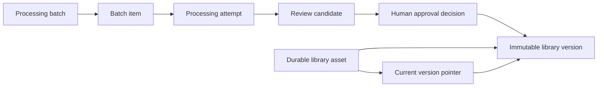

# Asset Library and versioning

## Identity boundaries

The processing `assets` table identifies generation/review work. The new
`library_assets` table identifies durable production outputs. Their IDs are
independent: equal names never imply equal identity. A reviewer explicitly creates
an asset or chooses an existing asset when publishing an approved result.

Batch membership records execution history. Phase F review records human decisions.
Neither is an Asset Library identity, and publication does not modify those services.

## Persistence

Schema **98** adds three tables idempotently:

| Table | Responsibility |
| --- | --- |
| `library_assets` | UUID, immutable internal name, mutable display name/type/category/tags/metadata, timestamps, archive flag, current version pointer |
| `library_asset_versions` | Monotonic number, immutable approved result and full lineage/configuration/review/candidate snapshots |
| `library_events` | Append-only creation, publication, promotion, rename/metadata, archive/restore history |

Version lineage includes the source generation asset, review candidate, approval
review event, Phase F approved-result version, processing attempt and batch/item
when present. Directly generated or legacy unbatched results have explicit null batch
references; a batch is never guessed from a name or rank. The complete processing
result and preserved raw-source reference are retained in provenance.

Each version freezes configuration, candidate metadata, review decision, approval
stamp, warnings, validation evidence and artifact references. SQL triggers prohibit
version/history updates and deletion. Foreign keys and insertion guards validate
source ownership. A current pointer must reference a version of the same asset.
Version numbers must be the next maximum number and cannot be reused.

## Publication and current version

Only the current **APPROVED** Phase F result can be published. NEEDS_REVIEW,
REJECTED and RETRY_REQUESTED results are refused. The UI selects an immutable
`approval:<approved_result_ref>` token. The publication transaction checks that this
is still the current approval, so a newer approval cannot silently replace a user's
selection. Programmatic calls accepting a generation asset ID mean its current approval.

Publication uses `BEGIN IMMEDIATE` to serialize numbering and idempotency checks.
An approved candidate/result is assigned to one production identity. Repeating its
publication returns that identity/version; an explicitly different target is rejected
with the existing identity reference. New approved results may be attached to an
explicitly chosen existing asset. Creating an asset and its first version is atomic.

New publication promotes its version. **Set Current Version** changes only the
asset pointer and records an event. Reverting from v002 to v001 creates no extra
version and changes no Phase F decision. Inspection with **View Version** does not
promote a version. Renaming changes the display name, not IDs, internal name or files.

Version `status=APPROVED` remains immutable. The library's source-review filter shows
the current Phase F review state separately; a later retry/rejection does not rewrite
an already published version's original approval snapshot.

## Artifacts and integrity

Library versions reference Phase F's already frozen approved GLB/Blend/thumbnail/
manifest paths. There is no additional heavy persistent copy. Each available artifact
has a publication SHA256 snapshot. Publication refuses a changed or missing primary
artifact. Detail inspection verifies the selected GLB hash, and View Version refuses
changed/missing content. The existing viewer uses its usual temporary preview copy;
this is not a new approved artifact.

`store.library_integrity_issues()` checks foreign-key errors, invalid current pointers,
archived identities without version history, and missing/changed recorded artifacts.
Version uniqueness and ownership are also enforced at the database boundary.

## Legacy migration and archive

Migration creates no production identities automatically. Valid Phase F approvals
appear in **Unassigned Approved Results** until explicitly published. Previous
Phase E/F rows, approval files, candidates, versions and histories remain intact.
The existing project/global library and variant controls remain available separately.

Archive hides an identity from the default active view without deleting versions,
lineage, artifacts or history. Restore reverses that flag. Referenced source records
are protected against deletion by foreign keys. Archived assets must be restored
before receiving new publications. There is no destructive delete action.

## UI and verification

The Library tab provides search by name, type, tags, date and version count; source
review-state and archive filters; independent library counters; version inspection;
source review navigation; read-only source-batch inspection; metadata and archive
controls; and explicit unassigned-result publication. Recently Updated counts assets
updated within the last seven calendar days. Library counters do not reuse batch counts.

Tests use the existing unittest framework, real SQLite and Gradio declarations, with
mocked model/Blender execution. Real Blender/native FaceReducer verification remains
separate; successful library/browser checks are not geometry-runtime verification.
